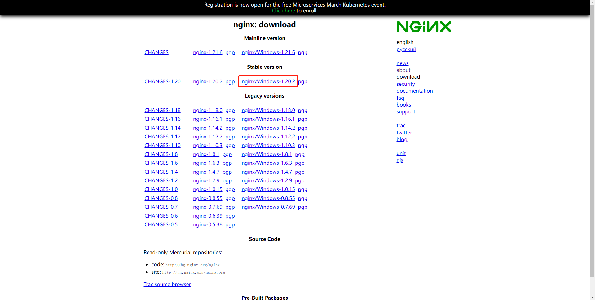
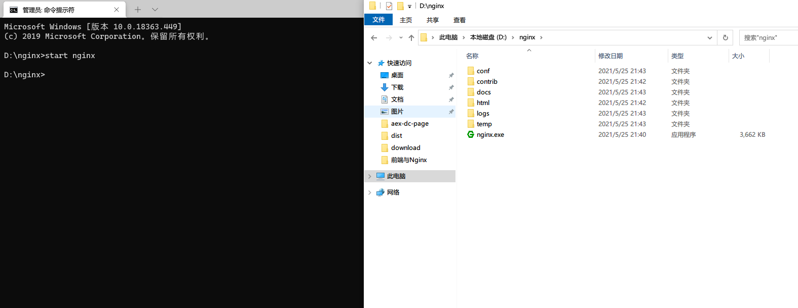
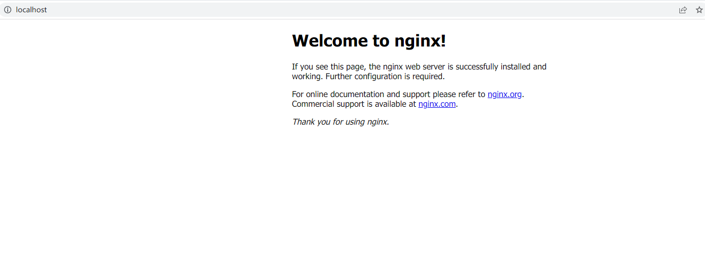
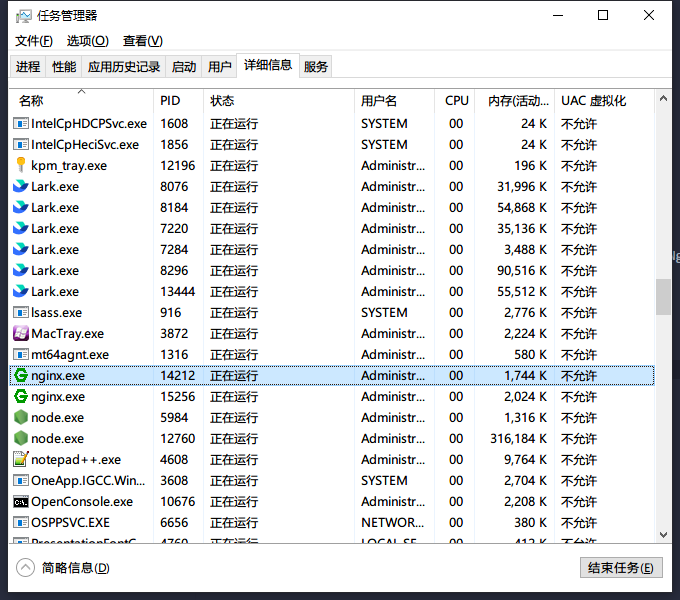
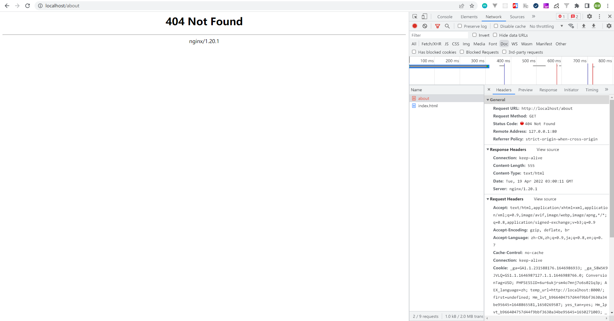
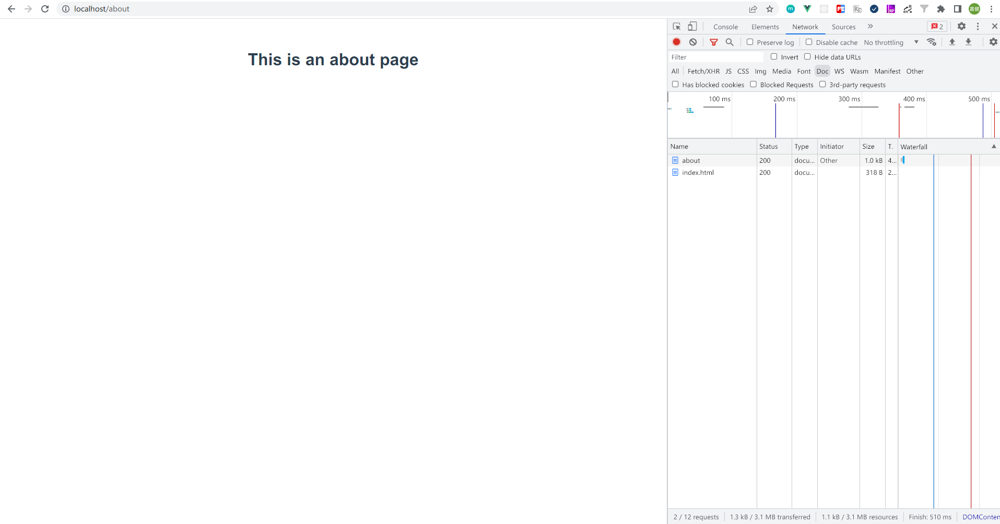

# 序言
由于 nginx 占市场 web 服务器的市场占有份额长期处于第一位，再加上它配置简单且易学，它成为最受欢迎的web服务器之一。前端部分就更简单了，配合一定的工具，你就能出色的完成常规的部署工作并惊艳你的同事。

## 安装 Nginx （有条件的可以用 Docker 安装镜像）

https://nginx.org/en/download.html
（没错，这个网站只是看起来破旧一些。）



然后 windows 用户下载这个链接。

本地解压后用 cmd 命令行工具打开文件。然后使用以下命令：

```
start nginx
```



**No news is good news!** （没有事情发生就是好事！说明 Nginx 服务已经启动）

打开 localhost 不需要端口号（因为默认是 80）



PS：如果你还在怀疑它是否已经启动？你可以在任务管理器中找到相关进程，如果 `nginx -s stop` 命令无法关掉就用任务管理器把进程杀掉。



## 了解配置（侧重前端）

我们的配置是在 nginx\conf\nginx.conf 文件里

有常见的站点名称、端口、重定向（可解决 http 请求的跨域问题）、路由拦截（解决 spa history 路由模式）

PS：先给大家安利一个 nginx 配置工具网站 http://nginxconfig.io/ 这里已经准备好生产环境所需要的配置，该页面为全选项式配置。妈妈再也不用担心我记不住配置了。配置好后下载配置文件然后覆盖在 nginx\conf 目录下即可。

### 1，站点名称

```http.server.server_name```

这个是 DNS 解析到 ip 并访问我们服务器上的哪个网站（其实就是**域名**），一般我们开发环境常用 localhost 。

注意：example.com 和 www.example.com 其实是两个网站。（这里初学者容易混淆，为什么我在浏览器输入 example.com 时网站会打不开，而 www.example.com 才可以。原因往往就是没有配置重定向所导致）

### 2，端口号

```http.server.listen```

常见有 80（对应 http） 、443（对应 https）

PS：我们在配置 SSL/TSL 证书时一般会要做强制重定向（即： 80端口的一切请求都重定向到 443 端口。这里不再详细讲）

### 3，重定向

#### 前置知识：浏览器路由模式 hash 和 history 的一些区别。

首先 SPA 架构有一个非常好的体验，就是切换页面时不需要刷新页面。原理是浏览器不会向 url 中带有 ‘#’ （也就是 hash 路由模式） 后面的内容发起请求。但也引入了一些问题如：url 变得难看，没法做锚点。。。

但是 history 模式需要运维的支持。否则就会如上述--浏览器会向服务器发起请求，但服务器并没有相关的资源，最后就会报 404 了。



注意：history 模式下，路由切换是通过 history.pushState() 去更新路由的，且更新后不会向服务器请求。要手动刷新页面后才会有 404 .

#### Nginx 重定向配置使 SPA 的 history 模式生效

先上答案：

```
location / {
    # 回退指令 
    # $uri 是一个参数例如：www.example.com
    # 而 $uri/ 指的是一个子路由例如：www.example.com/xxx
    # 将一切请求(例如：$uri 和 $uri/ 这类请求)都重新发到 index.html 文件下
	try_files $uri $uri/ /index.html;
}
```



除此之外还有使用 **rewrite** 和 **proxy_pass** 指令重定向 api 请求到别的服务端以绕过**跨域请求限制**

#### Nginx 负载均很分发请求，避开跨域请求限制

一般不处理跨域限制直接访问会：


首先我们要把 http 请求和其它请求（如：静态文静）划分清楚。

这里提供一种思路：如果后端 api 路由没有任何前缀，我们可以自行给 api 添加一个前缀（/api），以便 nginx 区分并转发。不需要担心会返回 404 .

例子：
将 /api/info/xxx 在 nginx 中以 /info/xxx 的形式去转发请求。

相关配置：
```
# 标点符号都不可以少
location ^~ /api/ {
	proxy_pass http://www.domain.com/;
}
```

结果如图：


切记：这里是向自己发起请求，而非向远端服务器发出请求。（这是为了满足跨域限制）

最终达到跨域请求的目的。

**一个教训**：proxy_pass 不要代理到 https 的域名上，否则会 404 .由于时间有限，未能查明原因。

所有配置（nginx\conf\nginx.conf）

```

#user  nobody;
worker_processes  1;

#error_log  logs/error.log;
#error_log  logs/error.log  notice;
#error_log  logs/error.log  info;

#pid        logs/nginx.pid;


events {
    worker_connections  1024;
}


http {
    include       mime.types;
    default_type  application/octet-stream;

    #log_format  main  '$remote_addr - $remote_user [$time_local] "$request" '
    #                  '$status $body_bytes_sent "$http_referer" '
    #                  '"$http_user_agent" "$http_x_forwarded_for"';

    #access_log  logs/access.log  main;

    sendfile        on;
    #tcp_nopush     on;

    #keepalive_timeout  0;
    keepalive_timeout  65;

    #gzip  on;

    server {
        listen       80;
        server_name  localhost;

        #charset koi8-r;

        #access_log  logs/host.access.log  main;

        location / {
            root   html;
            index  index.html index.htm;
			try_files $uri $uri/ /index.html;
        }
		
		location ^~ /api/ {
            # 这只是一个例子，实际要换成其它的域名测试 localhost 之类就好了
			proxy_pass http://www.aex.com/;	
		}

        #error_page  404              /404.html;

        # redirect server error pages to the static page /50x.html
        #
        error_page   500 502 503 504  /50x.html;
        location = /50x.html {
            root   html;
        }

        # proxy the PHP scripts to Apache listening on 127.0.0.1:80
        #
        #location ~ \.php$ {
        #    proxy_pass   http://127.0.0.1;
        #}

        # pass the PHP scripts to FastCGI server listening on 127.0.0.1:9000
        #
        #location ~ \.php$ {
        #    root           html;
        #    fastcgi_pass   127.0.0.1:9000;
        #    fastcgi_index  index.php;
        #    fastcgi_param  SCRIPT_FILENAME  /scripts$fastcgi_script_name;
        #    include        fastcgi_params;
        #}

        # deny access to .htaccess files, if Apache's document root
        # concurs with nginx's one
        #
        #location ~ /\.ht {
        #    deny  all;
        #}
    }


    # another virtual host using mix of IP-, name-, and port-based configuration
    #
    #server {
    #    listen       8000;
    #    listen       somename:8080;
    #    server_name  somename  alias  another.alias;

    #    location / {
    #        root   html;
    #        index  index.html index.htm;
    #    }
    #}


    # HTTPS server
    #
    #server {
    #    listen       443 ssl;
    #    server_name  localhost;

    #    ssl_certificate      cert.pem;
    #    ssl_certificate_key  cert.key;

    #    ssl_session_cache    shared:SSL:1m;
    #    ssl_session_timeout  5m;

    #    ssl_ciphers  HIGH:!aNULL:!MD5;
    #    ssl_prefer_server_ciphers  on;

    #    location / {
    #        root   html;
    #        index  index.html index.htm;
    #    }
    #}

}

```