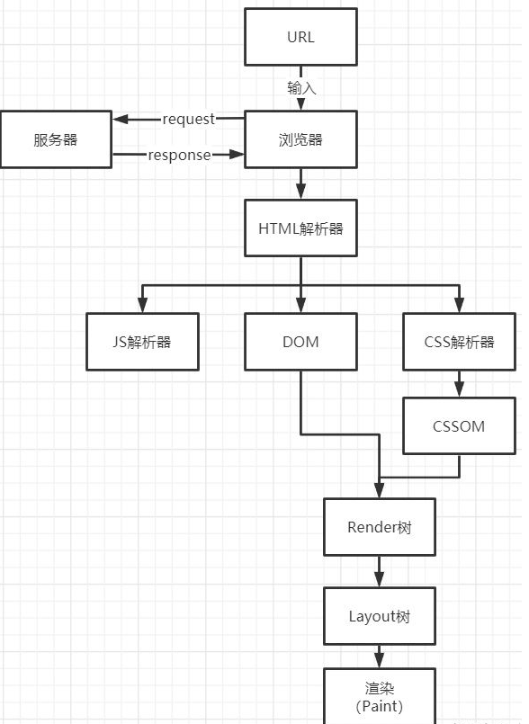
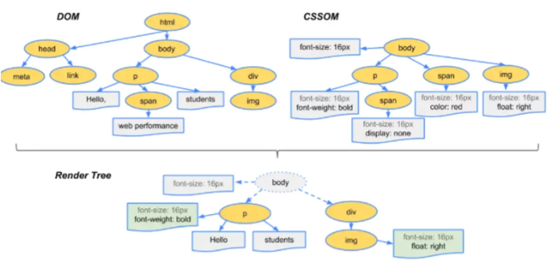
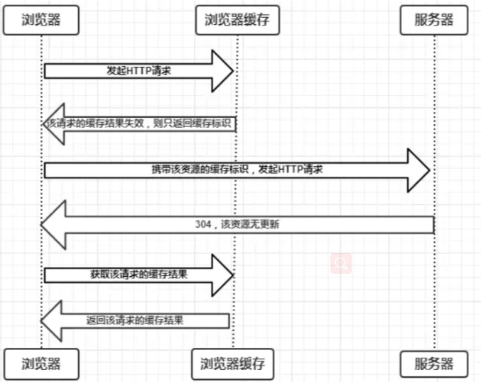
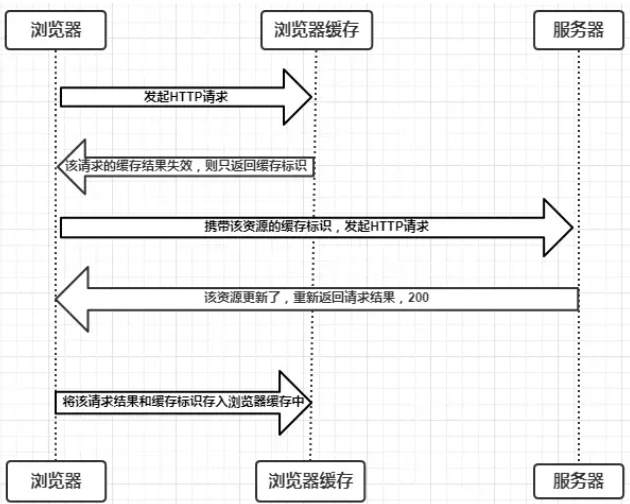

# 浏览器渲染机制、以及前端需要的优化点

:::tip
资料整理: 付永顺  
更新日期: 2021-08-13
:::

## 1、浏览器的组成

| 浏览器组成        | 内核                                                                     |
| ----------------- | ------------------------------------------------------------------------ |
| 用户界面          | 浏览器菜单栏、地址栏、向前                                               |
| 浏览器引擎        | 各组件间通信                                                             |
| 渲染引擎、js 引擎 | 负责显示请求内容（解析 HTML、css、解析 JS 脚本，并渲染出来）             |
| 网络模块          | 处理网络请求，图片资源等                                                 |
| 界面后端          | 浏览器的图形库，绘制基本浏览器窗口内控件                                 |
| 数据存储          | 管理用户数据，将浏览会话相关联的各种数据存在硬盘上（书签，cookie，缓存） |

### 1.1 浏览器的内核分类

| 浏览器        | 内核    |
| ------------- | ------- |
| IE            | Trident |
| Safari        | WebKit  |
| Opera、Chrome | Blink   |
| Firefox       | Gecko   |

## 2 浏览器渲染的整个流程



### 2.1 输入 URL 到页面呈现---网络篇(浏览器请求)

<strong>目的: 用户输入 URL，浏览器向服务器发一个请求，请求 URL 对应的资源</strong>

1. 浏览器构建请求行(请求方法、资源路径、HTTP 版本)

2. 查找强缓存(下面说)

3. DNS 解析(下面说)---将 URL 解析为对应的 IP 地址

4. 建立 TCP(传输控制协议: 一种面向连接的, 可靠的, 基于字节流的传输层通信协议)连接:3 次握手

5. 发送 HTTP 请求(请求行, 请求头, 请求体)

6. 网络响应(响应行, 响应头, 响应体)

### 2.2 输入 URL 到页面呈现---解析算法篇(加载)

<strong>说明：浏览器接收到服务器响应内容（字节）, 响应头中 Content-Type 值为 text/html, 浏览器开始解析与渲染，浏览器引擎（内核）：根据接收到的文件进行相应的解析(HTML 解析器自上而下开始解析)</strong>

1. 将 HTML 结构字符串解析成 DOM（前节点构建完成以后，才会去构建当前节点的下一个）

2. 将 CSS 解析成 CSSOM，与 DOM 结构相似

    DOM 和 CSSOM 具体构建流程 (优化点：DOM 树要小，CSS 尽量用 id 和 class , 不要过度层叠下去)


3. tokens 是一个 js 的嵌套数组(模板字符串的 JS 表示): 抽象语法树, 虚拟节点的鼻祖(提示：mustache：一款比较经典的前端引擎模板)

例如:

模板字符串

```html
<h1>我买了一个thing,好mode啊</h1>
```

tokens

```javascript
[
	['text', '<h1>我买了一个'],
	['name', 'thing'],
	['text', '好'],
	['name', 'mode'],
	['text', '啊</h1>']
];
```

​



<strong>阻塞渲染：</strong>浏览器渲染过程中遇到 js 文件

<strong>说明： </strong>js 文件可以通过 DOM API 和 CSSDOM API 来操作 DOM Tree 和 CSS Rule Tree

<strong>描述： </strong>遇到 script 标签会停止渲染，暂停构建 DOM，执行 js 代码，js 执行完成后，再恢复构建 DOM（浏览器的 GUI 渲染与 JS 引擎线程是互斥的，为防止渲染出现不可预期的结果）

<strong>原因+影响：</strong>由于 js 可改 DOM、还可修改样式，所以 js 执行时需要更改样式，就必须拿到完整的 CSSOM（CSSOM 未构建完成无法使用）不仅阻塞 DOM 构建，还会导致 CSSOM 也阻止 DOM 的构建

<strong>结果：</strong>js 加载运行脚本时，浏览器会先下载和构建 CSSOM，再执行 js，在继续构建 DOM,首屏渲染慢

<strong>优化：</strong>少在首屏加载 JS 文件，减少 DOM 操作

<strong>遵循两个原则</strong>

<strong>CSS 优先：</strong>CSS 资源先于 js 资源（ `<link>` 标签的 rel 属性设置为 preload 能够让你在你的 HTML 页面中可以指明哪些资源是在页面加载完成后即刻需要的,最优的配置加载顺序，提高渲染性能）

<strong>javascript 置后：</strong>js 放页面底部，并且 js 应该尽量少影响 DOM 的构建

<strong>webpack 插件 htmlWebpackPlugin：</strong>属性为 inject:false/head/true(body),为 true 表示所有 JavaScript 资源插入到 body 元素的底部

<strong>使用媒体类型(media type) or 媒体查询(media query)：</strong> 设置了媒体类型，会加载但不会阻塞。 提供了媒体查询，会在符合条件时阻塞渲染

```
<link href="vue.css" rel="stylesheet" media="print" />

<link
        href="vue.css"
        rel="stylesheet"
        media="(min-width: 30em) and (orientation: landscape)"
/>
```

<strong>注意点：</strong>DOM+CSSOM=构建 Render Tree(渲染树)≠DOM 树（类似 display:none，就没有必要放在渲染树中）；float 元素， absoulte 元素， fixed 元素会发生位置偏移（我们常说的脱离文档流，其实就是脱离 Render Tree）

<strong>重点：</strong>css 为什么不能嵌套太多

CSS 选择器是从右向左进行匹配, 相比于 `#markdown-content-h3` ，显然使用 `#markdown .content h3` 时，浏览器生成渲染树（render-tree）所要花费的时间更多。后者需要先找到 DOM 中的所有 `h3` 元素，再过滤掉祖先元素不是 `.content` 的，最后过滤掉 `.content` 的祖先不是 `#markdown` 的。页面中的元素越多，嵌套的层级越多，匹配所要花费的时间越多

<strong>选择器也是有权重：</strong>!importan>行内样式>id>类>标签>继承>、 合理运用选择器，选择器的轻重可以相加：避免使用**h3#markdown-content**类似的选择器

### 2.3 输入 URL 到页面呈现---解析渲染篇(渲染)

<strong>Layout：</strong>根据渲染树来对网页中的节点，节点的 css 定义，以及它们的从属关系，计算出每个节点在屏幕中的位置, 进行布局

<strong>painting：</strong>按照算出来的规则，通过显卡，把内容画到屏幕上

1. 建立图层树(Layer Tree)

2. 生成绘制列表

3. 生成图块并栅格化

4. 显示器显示内容

**Reflow(回流)：元素的几个尺寸改变，需要重新计算 Render Tree**

    常见引起回流属性和方法

1. 添加、删除可见的 DOM 元素（**display:none**）；

2. 元素尺寸改变——边距、填充、边框、宽度和高度

3. 浏览器窗口尺寸改变——resize 事件发生时

4. 读写 `offset` 族、 `scroll` 族和 `client` 族属性。

5. 调用 `window.getComputedStyle` 方法。

6. 设置 style 属性的值

`width` `height` `margin` `padding` `border` `display`

`clientWidth` `clientHeight` `clientTop` `clientLeft`

`offsetWidth` `offsetHeight` `offsetTop` `offsetLeft`

`scrollWidth` `scrollHeight` `scrollTop` `scrollLeft`

`geetComputedStyle()`

**Repaint(重绘)：元素的几个尺寸没有变，不影响整体布局**()

`color` `background` `border-style`

`outline-color` `outline` `border-radius` `box-shadow`

一般来说，浏览器会把这样的操作积攒一批，然后做一次 reflow，这又叫异步 reflow 或增量异步 reflow。但是有些情况浏览器是不会这么做的，比如：resize(调整)窗口，改变了页面默认的字体等这些操作，浏览器会马上进行 reflow。

回流包涵重绘（回流必发生重绘，重绘不一定引发回流）---影响性能

**优化:**

1. CSS 添加类的方式修改 DOM（一次性地改变样式）， 避免节点层级过多，尽可能修改层级比较低的 DOM

2. 对于 resize、scroll 等进行防抖/节流处理。

3. 使用 visibility 替换 display: none ，因为前者只会引起重绘，后者会引发回流（改变了布局）

4. 不要把节点的属性值放在一个循环里当成循环里的变量。

```javascript
for (let i = 0; i < 1000; i++) {
	// 获取 offsetTop 会导致回流，因为需要去获取正确的值
	console.log(document.querySelector('.test').style.offsetTop);
}
```

5. 不要使用 table 布局，可能很小的一个小改动会造成整个 table 的重新布局

6. 动画实现的速度的选择，动画速度越快，回流次数越多，也可以选择使用 requestAnimationFrame(为动画的 HTML 元素使用 fiex、absoult 定位)

> 直接合成: 例如 CSS3 的 `transform(top)` 、 `opacity` 、 `filter` 这些属性就可以实现合成的效果，也就是大家常说的**GPU 加速**(跳过布局和绘制, 进入非主线程)

**性能优化：**

1. vue-router, 组件使用懒加载, 当访问到相关页面才请求资源

2. 图片资源的压缩，使用精灵图, iconfont 字体图标

3. 开启 gizp 压缩: 一种 http 请求优化方式，通过减少文件体积来提高加载速度。html、js、css 文件甚至 json 数据都可以用它压缩，可以减小 60%以上的体积。前端配置 gzip 压缩，并且服务端使用 nginx 开启 gzip，用来减小网络传输的流量大小。

4. 减少首屏的 http 请求

5. 多用缓存：减少首屏加载的时间

6. webpack 层面:

> 生产环境关闭源码映射

> SplitChunks 抽取公有代码，提升你的应用的性能

> 使用 mini-xss-extract-plugin 提取 CSS 到单独的文件, 并使用 optimize-css-assets-webpack-plugin 来压缩 CSS 文件

7. 代码层面:

> v-for 时候加 key

> 合理使用 v-if, v-show\computed, watch

> beforeDestroy()生命周期内执行销毁事件(定时器等)

## 3 Web(电脑网页端)缓存种类

<strong>种类： </strong>数据库缓存，CDN 缓存，代理服务器缓存，浏览器缓存。（表现形式：超文本，超媒体、超文本传输协议）

| web 缓存类型   | 描述                                                                                          |
| -------------- | --------------------------------------------------------------------------------------------- |
| 数据库缓存     | 将查询后的数据放到内存中, 下次再查询时, 直接从内存缓存中获取, 从而提高响应速度                |
| CDN 缓存       | 当发送请求时, CDN 会帮计算得到内容的最短且快的路径(由网站管理员部署, 把常访问的内容当 CDN 中) |
| 浏览器缓存     | 每个浏览器都实现了 HTTP 缓存, 会根据一套与服务器约定的规矩进行缓存工作(前进\后退功能)         |
| 代理服务器缓存 | 同浏览器缓存性里类似, 规模更大, 群体更广                                                      |

<strong>浏览器缓存时查找顺序</strong>

Service Worker-->Memory Cache-->Disk Cache-->Push Cache

| Service Worker | 涉及到请求拦截, 传输协议必须为 https 来保障安全, 它可以让我们自己控制缓存那些文件, 如何匹配, 如何读取缓存, 并且缓存是持续性的, 离线缓存, 消息推送, 网络代理等(让 js 运行再主线程之外, 脱离了浏览器的窗体, 无法直接访问 DOM) |
| -------------- | --------------------------------------------------------------------------------------------------------------------------------------------------------------------------------------------------------------------------- |
| Memory Cache:  | 内存中的缓存, 主要包括当前页面中已经抓取的资源(样式, 脚本, 图片等), 读内存中的数据比读磁盘快, 但缓存持续性很短, 一旦关闭页面, 内存中的缓存也就释放了                                                                        |
| Disk Cache:    | 硬盘中的缓存, 存储量大, 存储时效久, 读取比较慢                                                                                                                                                                              |
| Push Cache:    | 推送缓存, 以上都没有, 才会被使用, 存储在 Session 中, 缓存时间短, 且并不会严格执行 http 头中的缓存指令                                                                                                                       |

### 3.1 浏览器缓存

<strong>概念：</strong>第一次访问网站，电脑会把网站的图片和数据下载到电脑上，当我们再次访问该网站的时候，网站就会从电脑中加载出来，这就是缓存
<strong>缓存优点：</strong>

1. 先在内存中查找,如果有,直接加载

2. 减少了服务器的负担，大大提升了网站的性能

3. 加快了客户端加载网页的速度

<strong>三级缓存原理 (访问缓存优先级)：</strong>

1. 先在内存中查找,如果有,直接加载。

2. 如果内存中不存在,则在硬盘中查找,如果有直接加载。

3. 如果硬盘中也没有,那么就进行网络请求。

4. 请求获取的资源缓存到硬盘和内存。

### 3.2 浏览器缓存机制

<strong>浏览器缓存过程：</strong>强缓存，协商缓存。

`强缓存`

(访问 URL 的时候，不会向服务器发送请求，直接从缓存中读取资源，但是会返回 200 的状态码)

**设置**

第一次进入页面：请求服务器, 服务器应答, 浏览器会根据 response Header 判断是否对资源进行缓存, 如果响应头中有 expires, pragma 或者 cache-control 字段, 代表强缓存, 浏览器就会把资源存在 memory cache(大部分操作系统文件等资源)或者 disk cache(图像和网页等资源)中,

第二次请求：浏览器判断请求参数, 如果符合强缓存条件, 直接返回状态码 200, 从本地缓存中拿数据, 否则把响应参数存在 request header 中, 看是否符合协商缓存, 符合返回状态码 304, 继续使用缓存, 不符合则服务器会返回全新资源

**expires:**

控制网页缓存的字段，值为一个时间戳, 服务器返回该请求结果缓存的到期时间，意思是，再次发送请求时，如果未超过过期时间，直接使用该缓存，如果过期了则重新请求

缺点: 否过期是用本地时间来判断的，本地时间是可以自己修改的

**Cache-Control(优先级更高):**

取值:

public: 资源客户端和服务器都可以缓存, 一个请求可能要经过不同的 `代理服务器` 最后才到达目标服务器，那么结果就是不仅仅浏览器可以缓存数据，中间的任何代理节点都可以进行缓存

privite：资源只有客户端可以缓存, 中间的代理服务器不能缓存。

no-cache：客户端缓存资源，但是是否缓存需要经过协商缓存来验证。

no-store：不使用任何形式的缓存。

max-age：缓存保质期(指定时间的秒数, 是相对时间)

**pragma**

禁用网页缓存的字段，其取值为 no-cache, 告诉浏览器忽略资源的缓存副本

`协商缓存`

强缓存失效后, 浏览器携带缓存标识符向服务器发送请求, 由服务器根据缓存标识来决定是否使用缓存的过程

协商缓存生效，返回 304；协商缓存失效，返回 200 和请求结果

**如何设置协商缓存**

<strong>方式一：</strong>

**Last-Modified：**

服务器响应请求时，返回该资源文件在服务器最后被修改的时间。

**If-Modified-Since：**

客户端再次发起该请求时，携带 Last-Modified 值。服务器收到该请求，发现请求头含有 If-Modified-Since 字段，则会根据 If-Modified-Since 的字段值与该资源在服务器的最后被修改时间做对比，若服务器的资源最后被修改时间大于 If-Modified-Since 的字段值，则重新返回资源，状态码为 200；否则则返回 304，代表资源无更新，可继续使用缓存文件。



<strong>方式二：</strong>(优先级高)

**Etag：**

服务器响应请求时，返回当前资源文件的一个唯一标识(由服务器生成)。

**If-None-Match：**

客户端再次发起该请求时，携带标识 Etag 值，服务器收到该请求后，发现该请求头中含有 If-None-Match，则会根据 If-None-Match 的字段值与该资源在服务器的 Etag 值做对比，一致则返回 304，代表资源无更新，继续使用缓存文件；不一致则重新返回资源文件，状态码为 200。



<strong>一般情况：</strong>html 协商缓存；css、js、图片：强缓存。(尽可能的命中强缓存, 更新版本时候 webpack 打包的时候, 在文件名带上 hash 值)。

<strong>强缓存与协商缓存的区别：</strong>

1. 强缓存不发请求到服务器，所以有时候资源更新了浏览器还不知道，但是协商缓存会发请求到服务器，所以资源是否更新，服务器肯定知道。

2. 大部分 web 服务都默认开启协商缓存

<strong>刷新对强缓存和协商缓存的影响：</strong>

1. ctr+f5, 跳过这两个, 直接服务器加载

2. f5, 跳过缓存, 会检查协商缓存

3. 手动输入 URL, 浏览器发现缓存中有这个文件, 不会再去请求, 直接去缓存拿

**浏览器本地存储**

1. `Cookie` 、 `WebStorage` ( `localStorage` 和 `sessionStorage` )和 `IndexedDB`

2. `Cookie` (解决 http 协议无状态协议: 无法识别客户端是谁)

3. 同一域名发送请求, 携带相同 Cookie, 服务器拿到 Cookie 进行解析, 拿到客户端状态(状态存储)

**特点：**

> `cookie`

1. 容量小、 4KB

2. 请求头一直携带 Cookie，造成巨大的性能浪费(请求携带了很多不必要的内容)

3. 安全性不高: 纯文本形式在浏览器和服务器中传递

4. `localStorage` (与 cookie 相似, 针对同一域名)

5. 容量大 5M, 持久存储

6. 只存在客户端, 不参与服务的通信

7. 接口封装, 通过 localStorage 暴露全局, 通过 setItem, getItem 操作, 方便

> `sessionStorage`

1. 容量大 5M, 不是持久化存储, 页面关闭, 就不存在了

2. 只存在客户端, 不参与服务的通信

3. 接口封装, 通过 sessionStorage 暴露全局, 通过 setItem, getItem 操作, 方便

> `IndexedDB`

1. 运行在浏览器中的非关系性数据, 本质是数据库, 容量没有上限, 能存储二进制数据, 为大型数据的存储提供了接口. 无法访问跨域数据库

**其他缓存：**

`DNS(域名系统)`

> <strong>概念：</strong>万维网上作为域名和 IP 地址相互映射的一个分布式数据库

> <strong>作用：</strong>通过域名得到对应的 IP 地址的过程

> <strong>例如：</strong>www.dnscache.com (域名) - DNS 解析 -> 11.222.33.444 (IP 地址)

> <strong>DNS 缓存：</strong>浏览器, 操作系统, Local DNS, 根域名服务器, 它们都会对 DNS 结果做一定程度的缓存

> <strong>DSN 查询：</strong>

> 1.  首先搜索浏览器自身的 DNS 缓存, 如果存在，则域名解析到此完成。

> 2.  浏览器自身的缓存里面没有找到对应的条目，那么会尝试读取操作系统的 hosts 文件看是否存在对应的映射关系, 如果存在，则域名解析到此完成。

> 3.  如果本地 hosts 文件不存在映射关系，则查找本地 DNS 服务器(ISP 服务器, 或者自己手动设置的 DNS 服务器), 如果存在, 域名到此解析完成。

> 4.  如果本地 DNS 服务器还没找到的话, 它就会向根服务器发出请求, 进行递归查询。

`CDN(内容分发网络)`

> <strong>概念：</strong>选择一个离用户最近的 CDN 节点, 最短的请求时间, 来响应用户请求, 拿到资源

> <strong>CDN 缓存：</strong>浏览器本地缓存失效后, 浏览器会向 CDN 边缘节点发起请求。类似浏览器缓存, CDN 边缘节点也存在着一套缓存机制. 一般会遵循 http 协议, 通过 http 响应头中的 Cache-control: max-age 来设置缓存时间

> <strong>优势：</strong>

> 1.  跨运营商和跨地域访问的问题，访问延时大大降低。

> 2.  CDN 起到了分流作用，减轻了源服务器的负载。

**问题一：两种盒模型（box-sizing: content-box 与 box-sizing: border-box）**

> <p> <strong>content-box：</strong>宽高都只包括（content）内容（不包括 padding、border）,任意设置 padding、border、盒子的整体大小都会改变</P>
> <p><strong>border-box：</strong>宽高包括 padding 、 border 、content，若盒子宽高固定，设置 padding 、 border，content 内容的宽高会随即改变，盒子大小不会有任何改变</P>

**问题二：为什么 button、input 的 outline 不会引起重绘，border 却会？**

> <p><strong>border：</strong>可应用于几乎所有有形的 html 元素，会影响元素的尺寸或者位置</p>
> <p><strong>outline：</strong>针对链接、表单控件和 ImageMap 等元素设，浏览器的默认行为，是绘制于元素周围的一条线，不占空间</p>
