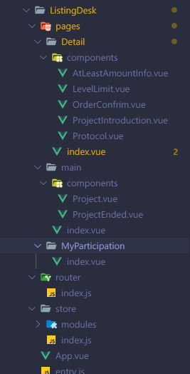
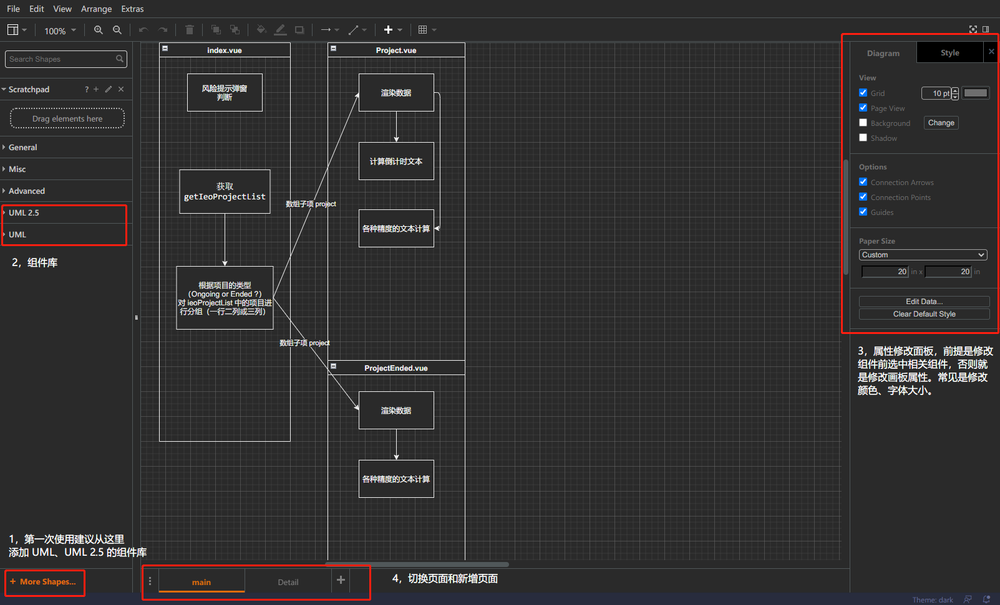
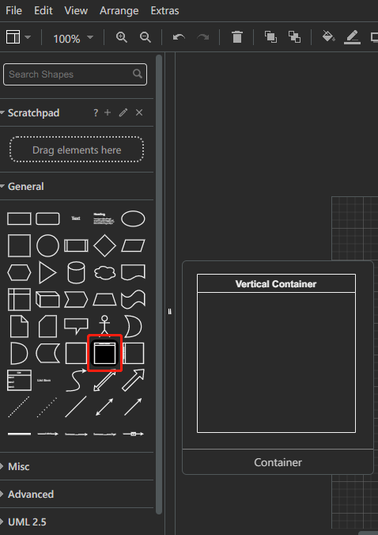
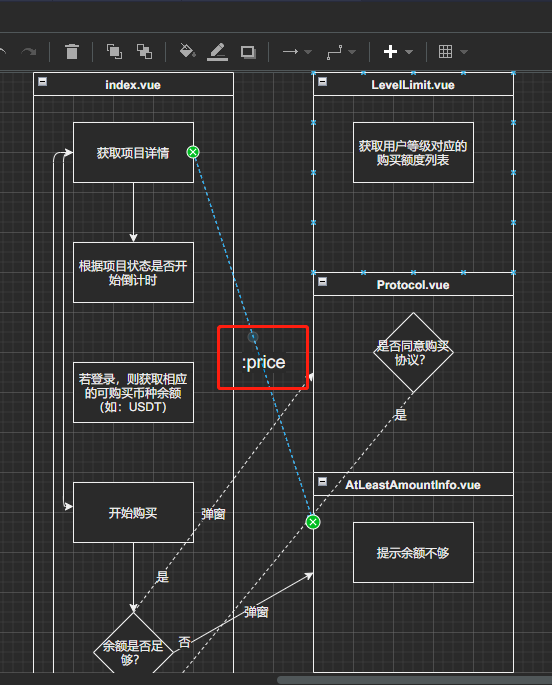
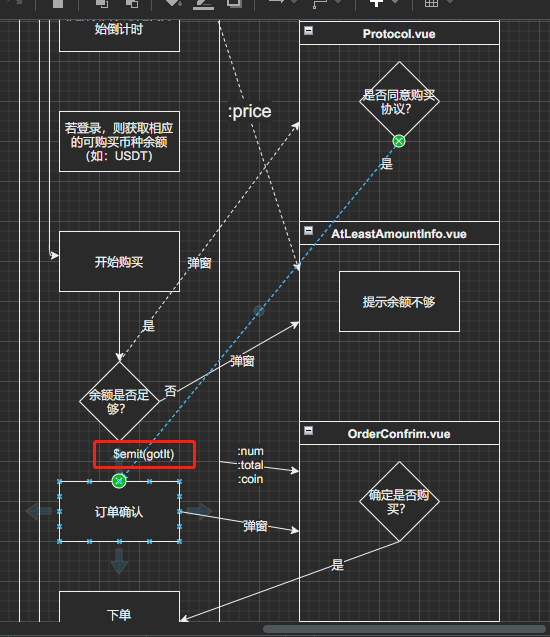
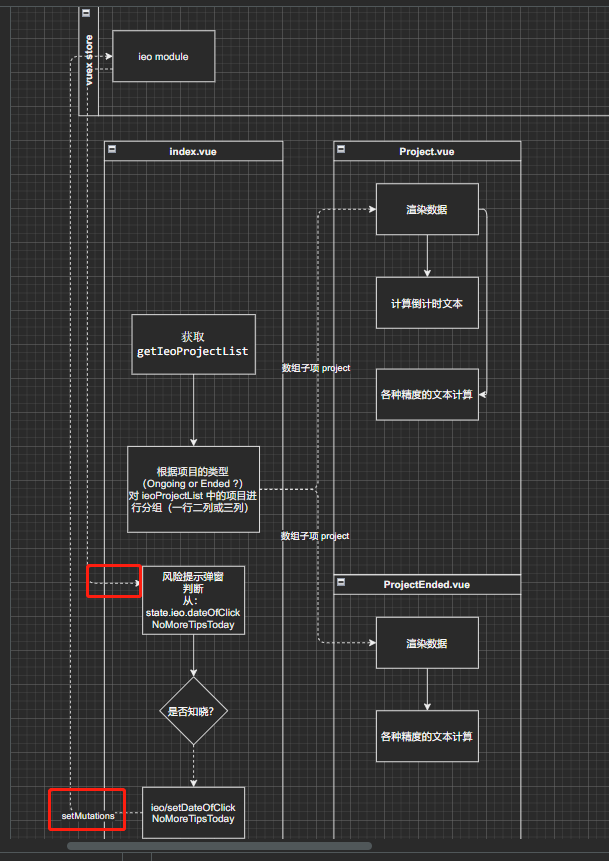
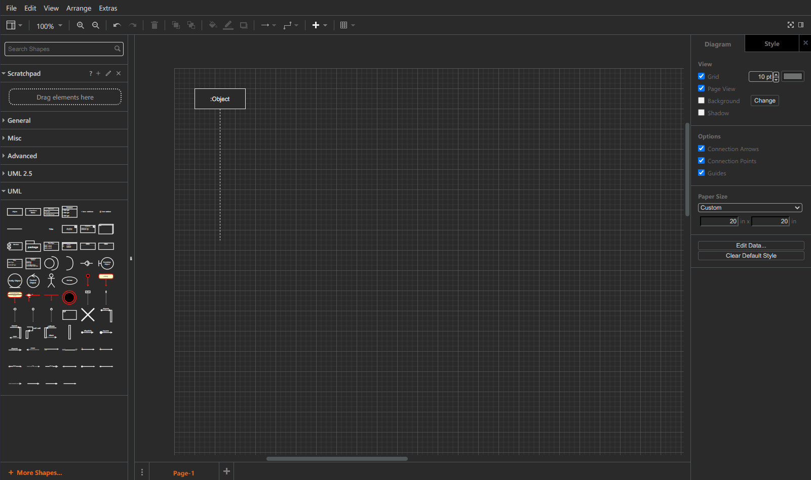

:::tip
资料整理: 刘嘉健   
更新日期: 2022-03-10
:::

# 背景

经历去年（2021）的新版社区翻车事件，才有这篇文章。由于习惯单人作战，一旦遇上多人协作就会乱套，比如：页面、组件的设计上存在许多不合理的地方，主要是在分配工作和沟通上出现问题。那么我们就需要通过科学有效的方法去做好上述需要改进的工作。（而非单凭一张嘴把工作分配完）

# 做这个的动机
1. 提高多人协作的工作效率
2. 减少不必要的沟通成本
3. 提高工时估计的准确性
4. 把写过的文档按页面保存到相应的路径下可以作为指引，帮助新入手的同事更快的了解项目的任务流程，而非单纯的通过读代码去认识项目。且该文档就有版本管理功能，可以随时修改。
# Vue.js 提高封装组件效率的前置知识点

## Props 属性继承

和 React 的高阶组件（HOC）道理相同

有 A、B、C 三个组件，对应的关系是 A（父）→ B（子）→ C（孙）。

此时的场景是在 A 的作用域需要把 C 的 props（price） 传递到 C 上，此时利用 v-bind="$attrs" 将 price 值，从 A 继承到 B 再继承到 C 了。而非通过逐个传 props 值。

具体代码实现 

```
<!-- 根组件 App.vue -->
<template>
    <CompA :price="'Some Price'"></CompA>
</template>
```

↓

```
<!-- A.vue -->
<template>
    <CompB v-bind="$attrs"></CompB>
</template>
```

↓

```
<!-- B.vue -->
<template>
    <CompC v-bind="$attrs"></CompC>
</template>
```

↓

```
<!-- C.vue -->
<template>
    <div>Your Price \{\{ price \}\}</div>
</template>
```

PS: 若某个 props 需要使用 .sync 修饰符（例如常见的 dialog 组件），只需要给 v-bind 添加 .sync 值即可，然后再补上相应的 emit 事件即可。

示例：

```
<dialog v-bind.sync="$attrs" @close="$emit('update:visible', false)">
</dialog>
```

> $attrs 相关文档 https://cn.vuejs.org/v2/api/#vm-attrs

## 事件冒泡传递

还是沿用以上例子，如果父组件 A 需要监听 B 或 C 组件的事件，不需要手动地从组件 B 或 C 通过 $emit 逐个向上传递，是通过 v-on="$listeners" 监听 $emit 事件并向上冒泡。

示例代码如下：

```
<!-- 根组件 App.vue -->
<template>
    <CompA @eventFromC="eventFromC"></CompA>
</template>
```

↓

```
<!-- A.vue -->
<template>
    <CompB v-on="$listeners"></CompB>
</template>
```

↓

```
<!-- B.vue -->
<template>
    <CompC v-on="$listeners"></CompC>
</template>
```

↓

```
<!-- C.vue -->
<template>
    <div @click="$emit('eventFromC')">Your Price \{\{ price \}\}</div>
</template>
```

PS: 当然，组件 B 也可以继续监听组件 C 的事件，并不影响组件 A 的监听。

# 正文

我个人偏向用绘图的方式表达逻辑，这里推荐使用 diagram 的画图工具 https://app.diagrams.net/ ，该工具开源且免费，可以使用 VSCode 的插件（Draw.io Integration）直接打开对应的文档文件。

文档的规划应该考虑到以下几个方面

## 业务流程的梳理

这里并不是简单的把PM的需求文档抄过来即可，而是通过自己的理解将代码的架构通过 **流程图** 或 **UML 时序图** 表达出程序在不同的时间段要做的事情（不需要详细的指出细节，下面模块设计会补充）。在此我们把相应的事件连接起来形成一个代码**大纲（outline）**。

> 对应示例 Listing-Desk流程图.drawio （以该线上项目作为案列）

## 模块设计

将业务梳理的结果转化成详细的代码，即：有对应的 **页面** → **组件**的结构。

需要细化到代码细节的设计，具体到画图中需要理清组件之间的 **数据（props）** / **事件（event）** 流向和单位组件间的逻辑流程说明。合理分割代码，拒绝臃肿💩🗻。

> 对应示例 Listing-Desk 组件规划.drawio 

### 关于文件目录设计的一些建议

可以参考 nuxt 项目，将页面（容器）文件用 index 命名，组件统一放到页面文件夹下的 components 文件夹中。

简化版的示例：



> 具体可以参考 nuxt 的文档。https://www.nuxtjs.cn/guide/directory-structure

## 状态设计（特指使用 vue.js 的项目）

在模块设计的过程中需要考虑是用 props + $emit 组合的形式进行状态分享，抑或是使用 Vuex 全局共享。至于 session\localStorage 就不推荐使用了。前者两种方式已经能满足绝大部分的应用场景，再加上 vuex-persisitedstate 已经应用在项目之中，已经可以代替 localStorage 的功能。（若万不得已，不要用这个东西，状态量一多，维护起来将十分麻烦）

## 文档索引（可选）

建议使用 npm 的 tree-node-cli 创建文件树目录，并附上注释说明。

示例：

```
practise // 项目文件夹~~~
├── 15206552590846or8n6o1pn.gif // 说明~~~
├── Listing-Desk 组件规划.drawio
├── Listing-Desk流程图.drawio
├── a.js
├── a.json
├── contract_protocol_zh.html
├── extract-i18n.js
├── index.html
├── index.js
├── package-lock.json
├── package.json
├── str.txt
├── zh.json
├── 关于代码设计与多人协作存在的问题.md
└── 文件树示例.png
```

# 态度（回归人性）

坚持到这里，已经算是有一个比较完善的文档，在编码上应该是胸有成竹的，但过程还是比较繁琐，从人性上我们总会下意识的逃避这种对业务没有任何帮助的事情，**‘时间不够’**成为永远的借口。

写代码心急是大忌，当然文档的编写理应要做，但可以根据时间的充裕程度去控制文档的细节程度（或者后续再继续细化）。

# draw.io 使用说明及相关注意
1. 常用功能介绍

如图：



2. 常用表达的方式（vue组件、props、emit、vuex状态）

vue组件（代指一个容器装载着各种逻辑）。如图：



props、emit 事件 在连接线上标好对应的props与emit事件名称（双击线条就可以写上文本）即可。如图：





vuex 状态。这也是一个容器，但里面主要都是状态，所以从优先级上是高于任何一个组件的，故放到最顶端，为提高模型的阅读性，可以不画引用的线条（可能会有许多地方被引用，导致阅读性较差），画好 setMutations 和 setActions 即可。如图：



3. 画图的坑

将直线改成曲线（表达自己调用自己的方法）

PS: 貌似这个工具有一个 bug 不能把刚生成好的曲线直接拖动位移，需要用键盘的‘上下左右’按键左右移动后才能拖动。演示如以下动图



线条太多可以将相交部分的线换成虚线（注意选中组件时右侧会有侧边栏修改样式）

Listing-Desk 组件规划.drawio 中的 detail 页有示例

[Listing-Desk组件规划.drawio](./static/Listing-Desk2.drawio)

[Listing-Desk流程图.drawio](./static/Listing-Desk1.drawio)

> 参考链接：

1. https://jishuin.proginn.com/p/763bfbd639da
2. https://segmentfault.com/a/1190000015590301
3. https://juejin.cn/post/6844903936504119304
