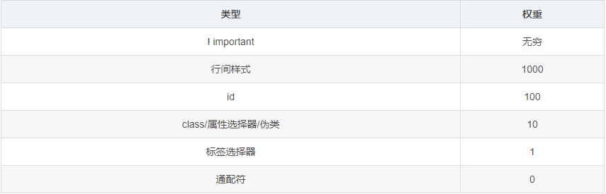

# js, css 前端优化知识点

:::tip
资料整理: 孙观源   
更新日期: 2021-08-19
:::

#### 前端性能的影响（为什么要优化性能 ❗️❗️❗️）:

前端性能的一个重要指标是页面加载时间，不仅事关用户体验，也是搜索引擎排名考虑的一个因素。 
来自 Google 的数据表明，一个有 10 条数据 0.4 秒能加载完的页面，变成 30 条数据 0.9 秒加载完之后，流量和广告收入下降 90%。
Google Map 首页文件大小从 100KB 减小到 70-80KB 后，流量在第一周涨了 10%，接下来的三周涨了 25%。
亚马逊的数据表明：加载时间增加 100 毫秒，销量就下降 1%。 
总结就是：性能越好，用户浏览意愿才高，能把网站内容更完整的向用户输出。

---

#### 渲染主流程:

浏览一个页面的时候，主要会经历: 
url 输入 ---> dns 解析 ---> 服务器响应 ---> 浏览器解析渲染 ---> 页面呈现 
 
现在主要针对浏览器解析渲染做个讲解： 

*   【Loader】
    > Loader 模块负责处理所有的 HTTP 请求以及网络资源的缓存，相当于是从 URL 输入到 Page Resource 输出的变换过程。HTML 页面中通常有外链的 JS/CSS/Image 资源，为了不阻塞后续解析
    > 过程，一般会有两个 IO 管道同时存在，一个负责主页面下载，一个负责各种外链资源的下载。  
    > 注意：虽然大部分情况下不同资源可以并发下载异步解析（如图片资源可以在主页面解析显示完成后再被显示），但 JS 脚本可能会要求改变页面，因此有时保持执行顺序和下载管道后续处理的阻塞是不可避免的。 

*   【Parser】
    > -   1、解析 HTML 
    >     Parser 模块主要负责解析 HTML 页面，完成从 HTML 文本到 HTML 语法树再到文档对象树（DocumentObject Model Tree，DOM Tree）的映射过程。  
    >     HTML 语法树生成是一个典型的语法解析过程，可以分成两个子过程：词法解析和语法解析 
    >     词法解析按照词法规则（如正则表达式）将 HTML 文本分割成大量的标记（token），并去除其中无关的字符如空格。 
    >     语法解析按照语法规则（如上下文无关文法）匹配 Token 序列生成语法树，通常有自上而下和自下而上两种匹配方式。  
    >     浏览器内核中对 HTML 页面真正的内部表示并不是语法树，而是 W3C 组织规范的文档对象模型(Document Object Model，DOM)。DOM 也是树形结构，以 Document 对象为根。DOM 节点基本和 HTML 语法树节点一一对应，因此在语法解析过程中，通常直接生成最终的 DOM 树
    > -   2、解析 CSS 
    >     页面中所有的 CSS 由样式表 CSSStyleSheet 集合构成，而 CSSStyleSheet 是一系列 CSSRule 的集合，每一条 CSSRule 则由选择器 CSSStyleSelector 部分和声明 CSSStyleDeclaration 部分构成，而 CSSStyleDeclaration 是 CSS 属性和值的 Key-Value 集合。  
    >     CSS 解析完毕后会进行 CSSRule 的匹配过程，即寻找满足每条 CSS 规则 Selector 部分的 HTML 元素，然后将其 Declaration 部分应用于该元素。实际的规则匹配过程会考虑到默认和继承的 CSS 属性、匹配的效率及规则的优先级等因素。 
    >
    > -   3、解析 Javascript 
    >     JavaScript 一般由单独的脚本引擎解析执行，它的作用通常是动态地改变 DOM 树（比如为 DOM 节点添加事件响应处理函数），即根据时间（timer）或事件（event）映射一棵 DOM 树到另一棵 DOM 树。  
    >     简单来说，经过了 Parser 模块的处理，内核把页面文本转换成了一棵节点带 CSS Style、会响应自定义事件的 Styled DOM 树

*   【layout】
    > Layout 过程就是排版，它包含两大过程 
    >
    > -   1、创建渲染树 
    >     布局树（或者叫做渲染树、Render Tree）和 DOM 树大体能一一对应，两者在内核中同时存在但作用不同。DOM 树是 HTML 文档的对象表示，同时也作为 JavaScript 操纵 HTML 的对象接口。Render 树是 DOM 树的排版表示，用以计算可视 DOM 节点的布局信息（如宽、高、坐标）和后续阶段的绘制显示。  
    >     注意：并非所有 DOM 节点都可视，也就是并非所有 DOM 树节点都会对应生成一个 Render 树节点。例如 head 标签（HTMLHeadElement 节点）不表示任何排版区域，因而没有对应的 Render 节点。同时，DOM 树可视节点的 CSS Style 就是其对应 Render 树节点的 Style。  
    >
    > -   2、计算布局 
    >     布局就是安排和计算页面中每个元素大小位置等几何信息的过程。HTML 采用流式布局模型，基本的原则是页面元素在顺序遍历过程中依次按从左至右、从上至下的排列方式确定各自的位置区域。  
    >     一个 HTML 元素对应一个以 CSS 盒子模型描述的方块区域，HTML 元素分成两个基本类型，Inline 和 Block。Inline 元素不会换行，按从左到右来布局。Block 元素的出现意味着需要从上至下换到下一行来布局。除了这种基本的顺序按照元素的 Inline 和 Block 来进行流式布局之外，还有特殊指定的一些布局方式，如 Absolute/Fixed/Relative 三种定位布局以及 Float 浮动布局。  
    >     简单情况下，布局可以顺序遍历一次 Render 树完成，但也有需要迭代的情况。当祖先元素的大小位置依赖于后代元素或者互相依赖时，一次遍历就无法完成布局，如 Table 元素的宽高未明确指定而其下某一子元素 Tr 指定其高度为父 Table 高度的 30%的情况。  
    >     经过了 Layout 阶段的处理，把带 Style 的 DOM 树变换成包含布局信息和绘制信息的 Render 树，接下来的显示工作就交由 Paint 模块进行操作了。 

*   【Paint】
    > Paint 模块负责将 Render 树映射成可视的图形，它会遍历 Render 树调用每个 Render 节点的绘制方法将其内容显示在一块画布或者位图上，并最终呈现在浏览器应用窗口中成为用户看到的实际页面。每个节点对应的大小位置等信息都已经由 Layout 阶段计算好了，节点的内容取决于对应的 HTML 元素，或是文本，或是图片，或是 UI 控件。  
    > 通常情况下，布局和绘制是相当耗时的操作。如果 DOM 树每次略有改动都要重新布局和绘制一次，效率会相当低下。因此，一般浏览内核都会实现一种增量布局和增量绘制的方式。当一个 DOM 树节点（或者它的子节点）内容或者样式发生变化时，内核会确定其影响范围，在布局阶段会标记出受该节点布局影响的其他节点（比如可能是子节点），在绘制阶段则会标记出一个 Dirty 区域并通知系统重绘。  
    > 按照 HTML 相关规范，页面元素的 CSS 属性也规定了其绘制顺序，如根据不同 Layer 必须按顺序绘制，否则覆盖叠加效果会出现错误，如元素的边框轮廓和内容背景的绘制次序也有规定。 

##### 三棵树构建：

*   【DOM 树构建】
    > DOM（Document Object Model，文档对象模型），是中立于平台和语言的接口。它允许程序和脚本动态地访问和更新文档的内容结构和样式。DOM 是页面上数据和结构的一个树形表示，使用 DOM 接口可以对 DOM 树结构进行操作。DOM 规范只是定义了编程接口，没有对文档的表示方式做任何限制。以树状结构表示 DOM 文档是比较普遍的实现方式。这个树状结构就称为 DOM 树。DOM 树是 DOM 文档中的节点按照层次组织构成的。以 HTML 文档为例，每一个标签都对应着 DOM 树上的一个节点。由于是树形结构表示，这些节点之间的关系也是通过父子或兄弟维系的。  
    > 渲染引擎解析 HTML 文档的过程就是将字节流形式的网页内容解析成 DOM Tree、Render Tree、Render Layer Tree 三棵树的过程。这个过程可以分为解码、分词、解析、建树四个步骤: 
    >
    > -   解码：将网络上接收到的经过编码的字节流，解码成 Unicode 字符。  
    > -   分词：按照一定的切词规则，将 Unicode 字符流切成一个个的词语(Tokens)。  
    > -   解析：根据词语的语义，创建相应的节点(Node)。  
    > -   建树：将节点关联到一起，创建 DOM 树、Render 树和 RenderLayer 树。  

*   【Render 树构建】
    > Render 树用于表示文档的可视信息，记录了文档中每个可视元素的布局及渲染方式。Render 树与 DOM 树是同时创建的。  
    > HTML 页面通过 CSS 控制页面布局，所以 RenderObject 需要知道自身的 CSS 属性，CSSStyleSelector 负责为元素提供 RenderStyle。RenderObject 包含自身的 RenderStyle 的引用。CSSStyleSelector 是在 CSS 解析过程中生成的。Render 节点创建后，就会被 attach 到 Render 树上。  
    > 当前 Render 节点的父节点负责将当前 Render 节点插入到合适的位置，当父 Render 节点设置好当前 Redner 节点的前后兄弟节点后，当前 Render 节点就 attach 到了 Render 树上。  
    > RenderObject 是 Render 树所有节点的基类，作用类似于 DOM 树的 Node 类。这个类存储了绘制页面可视元素所需要的样式及布局信息，RenderObject 对象及其子类都知道如何绘制自己。事实上绘制 Render 树的过程就是 RenderObject 按照一定顺序绘制自身的过程。DOM 树上的节点与 Render 树上的节点并不是一一对应的。只有 DOM 树的根节点及可视节点才会创建对应的 RenderObject 节点。  

*   【Render Layer 树构建】
    > RenderLayer 树以层为节点组织文档的可视信息，网页上的每一层对应一个 RenderLayer 对象。RenderLayer 树可以看作 Render 树的稀疏表示，每个 RenderLayer 树的节点都对应着一棵 Render 树的子树，这棵子树上所有 Render 节点都在网页的同一层显示。  
    > RenderLayer 树是基于 RenderObject 树构建的，满足一定条件的 RenderObject 才会建立对应的 RenderLayer 节点。下面是 RenderLayer 节点的创建条件：
    >
    > -   网页的 root 节点  
    > -   有显式的 CSS position 属性（relative，absolute，fixed）  
    > -   元素设置了 transform  
    > -   元素是透明的，即 opacity 不等于 1  
    > -   节点有溢出（overflow）、alpha mask 或者反射（reflection）效果  
    > -   元素有 CSS filter（滤镜）属性  
    > -   2D Canvas 或者 WebGL  
    > -   Video 元素  
    >     当满足这些条件之一时，RenderLayer 实例被创建。RenderObject 节点与 RenderLayer 节点是多对一的关系，即一个或多个 RenderObject 节点对应一个 RenderLayer 节点。这一点可以理解为网页的一层中可包含一个或多个可视节点。RenderLayer 树的根节点是 RenderView 实例。  
    >     RenderLayer 的一个重要用途是可以在绘制时实现合成加速，即每一个 RenderLayer 对应系统的一块后端存储，这样在网页内容发生更新时，可以只更新有变化的 RenderLayer，从而提高渲染效率。  

---

#### 总结渲染规则:

理解渲染机制，总结渲染过程的规则，从中得到优化性能点；

渲染规则：

> -   浏览器有缓存机制，资源加载按网站设置会优先读取本地缓存，课题比较大可以单独查阅资料  
> -   dns 查询：dns 缓存->浏览器缓存查询->本地 host 查询->服务来查询  
> -   每个资源请求都是面向服务器，高峰期容易引起服务器负载太高  
> -   加载下来的文档从上而下顺序解析  
> -   js 的加载引入能阻塞页面渲染，针对 script 标签  
> -   script 标签分为：async：异步执行脚本；defer：当页面已完成解析后，执行脚本；  
> -   link 标签加载不阻塞页面渲染，可以了解下 link 标签的 rel 属性  
> -   cookie 会被请求携带给服务器  
> -   css 继承性  
> -   页面渲染依赖于 css 的加载(首屏空白，闪屏)  
> -   浏览器资源加载并发数是有上限的  
> -   CSSOM 构建时，JavaScript 执行将暂停，直至 CSSOM 就绪  
> -   浏览器重定向：客户端收到服务器的重定向响应后，会根据响应头中 Location 的地址再次发送请求。重定向会影响用户体验，尤其是多次重定向时，用户在一段时间内看不到任何内容，只看到浏览器进度条一直在刷新。  
> -   css 选择器从右向左的匹配，查询量庞大  
> -   全局变量，闭包，占用内存不关闭页面不销毁  
> -   浏览器有两种渲染模式：软件渲染和硬件渲染  
> -   css 权重（见后）  
> -   GPU 硬件加速：使用 transform、opacity、filters、Will-change 可以启用 GPU 加速  
> -   重绘：其实就是触发浏览器的 paint 的过程  
> -   回流：其实不仅仅是触发了 paint 的过程还触发 layout 的过程  
> -   页面生成以后，脚本操作、样式表变更，以及用户操作都可能触发重绘和回流（见后）  
> -   table 渲染通常要 3 倍于同等元素时间  
> -   导致页面无法响应的原因是执行栈中还有任务未执行完，或者是 js 引擎线程被渲染线程堵塞  
> -   iframe 标签 完全加载以后，父页面才会触发 load 事件。 Safari、Chrome 中通过 JavaScript 动态设置 iframe src 可以避免这个问题  
> -   DOM 操作：其实是页面不断重复渲染的过程，如果这个过程很复杂，或者操作频繁，或逻辑错误，就会造成性能问题  
> -   每次 DOM 操作，页面 DOM 结构通常都有可能会被改变，浏览器一旦检测到 DOM 结构发生改变，就会进行全局的重绘，相当于每次 DOM 操作都对页面重新渲染了一遍  

---

#### 其他知识点:

*   css 权重 
    

 

*   重绘 
    > 回流 reflow 是 firefox 里的术语，在 chrome 中称为重排 relayout   
    > 回流是指窗口尺寸被修改、发生滚动操作，或者元素位置相关属性被更新时会触发布局过程，在布局过程中要计算所有元素的位置信息。由于 HTML 使用的是流式布局，如果页面中的一个元素的尺寸发生了变化，则其后续的元素位置都要跟着发生变化，也就是重新进行流式布局的过程，所以被称之为回流  
    > 前面介绍过渲染引擎生成的 3 个树：DOM 树、Render 树、Render Layer 树。回流发生在 Render 树上。常说的脱离文档流，就是指脱离渲染树 Render Tree   
    > 触发回流包括如下操作：   
    > 1、DOM 元素的几何属性变化   
    > 2、DOM 树的结构变化   
    > 3、获取下列属性  
    > offsetTop\offsetLeft\offsetWidth\offsetHeight\scrollTop\scrollLeft\scrollWidth\scrollHeight\clientTop\clientLeft\clientWidth\clientHeight\getComputedStyle()\currentStyle()  
    > 4、改变元素的一些样式   
    > 5、调整浏览器窗口大小   
    > 触发回流一定会触发后续的重绘操作，而且对一个元素的回流，可能会影响到父级元素。比如子元素浮动后，父元素会出现高度塌陷的情况。所以，性能优化的重点在于尽量只触发小规模的重绘，尽量不触发回流  

*   回流 
    > 重绘是指当与视觉相关的样式属性值被更新时会触发绘制过程，在绘制过程中要重新计算元素的视觉信息，使元素呈现新的外观  
    > 由于元素的重绘 repaint 只发生在渲染层 render layer 上。所以，如果要改变元素的视觉属性，最好让该元素成为一个独立的渲染层 render layer  
    > 下面以元素显示为例，进行说明。实现元素显示隐藏的方式有很多  
    > display: none/block，会引起回流，从而引起重绘，性能较差  
    > visibility: visibile/hidden，只引起重绘，但由于没有成为一个独立的渲染层，会引起整个页面（或当前渲染层）的重绘，性能较好  
    > opacity: 0/1，opacity 小于 1 时，会产生 render layer。所以 opacity 在 0、1 的变化中，引起了 render layer 的生成和销毁，因此，也会引起回流，从而引起重绘，性能较差。如果 opacity: 0/0.9，则只会引起重绘  
    > 如果对一个元素使用硬件加速渲染，如具有 CSS 3D 属性，则不会进行重绘和回流。但如果使用硬件渲染的元素过多，会造成 GPU 的传输压力  

---

#### 性能问题的简单分析、直接表现、根本原因:

*   简单分析： 
    > 首先，一个完整的页面按照 MVC 架构，或是数据与表现分离的思想，可以细分成三部分。一是通过 html(结构)+css(表现)渲染出来的 UI 层(view)，二是通过 http 来完成的数据层(model)，三是将数据填充到 view 或者 DOM 操作的控制层(controller)。  
    > 于是，一次完整的页面加载就可以分成三部分工作，一是 view 渲染(UI)，二是数据加载(http)，三是数据填充到 view 或更改(DOM 操作)。其中只要有一个环节出问题，都有可能造成性能问题。  
    > 综上所述，我们可以总结出三个主要可能造成性能问题的环节：UI 渲染、http 请求、DOM 操作。  
    > 总而言之，要优化性能问题，就需要对可能造成性能问题的环节逐个击破。  

*   直接表现：
    > -   页面加载时间过长  
    > -   卡顿、闪现、页面结构错乱等现象  

*   根本原因：
    > -   DOM 结构复杂  
    > -   过度或不恰当的 DOM 操作  
    > -   http 请求过多、请求时间过长、请求异常(中断、无响应、请求错误)等情况  

---

#### 优化建议:

*   html 结构优化
    > -   保证简洁、清晰的 html 结构，减少或避免多余的 html 标签; 
    >     原因：dom 越少，页面解析速度越快;易读性强 
    >     如:div>ul>li, 优化：ul>li  
    > -   css 文件在 head 中引入，js 文件放在 body 底部引入 
    >     原因：可以防止渲染阻塞 
    >     如:html>head>link.css>script.js>body,优化：html>head>link.css>body>script.js>/body  
    > -   img 标签给定宽高 
    >     原因：防止图片资源在首次渲染后返回，造成回流 
    > -   防止 src 属性和 link 的 href 属性为空 
    >     原因：浏览器很可能会把当前页面当成其属性值发送请求 
    >     如：a href=''，优化：a href='javascript:;'  
    > -   链接为目录或首页的地址后面加”/” 
    >     原因：引起浏览器重定向，相当无我们的进入网站然后刷新的操作 
    >     如：http://www.qq.com，优化：http://www.qq.com/  
    > -   不重要的资源考虑 script 的 defer 属性，等页面执行后加载 
    >     原因：过多的资源阻塞浏览器首屏渲染  
    > -   不重要的资源考虑 link 的 rel 属性，等页面执行后加载 
    >     原因：过多的资源阻塞浏览器首屏渲染,减少 script 标签阻塞  
    > -   避免使用 iframe 标签 
    >     原因：阻塞父级的渲染  

*   css 优化
    > -   动画尽量使用 css3 实现 
    >     原因：可以触发硬件 gpu 加速，减少 dom 操作就能减少回流和重构  
    > -   减少使用 box-shadow、border-radius、float 
    >     原因：这三个属性计算量大  
    > -   小图标可以嵌入 html 结构中，或者使用字体图标 
    >     原因：减少资源请求数量  
    > -   避免通配符选择器 
    >     原因：通配符会找到父级下所以标签都添加该样式，查询量大  
    > -   减少层级最多使用三层选择器，少使用标签选择器 
    >     原因：css 解析是通过从右到左顺序，层级越多，查询次数越多，像标签选择器；会先找到该类所有标签，然后筛选层层父级 
    >     如：ul li, 优化：.item-li(直接定义 class)  
    > -   避免使用 table 布局 
    >     原因：table 布局，改动一点就会触发整个 table 的回流重构，并且 table 比平常布局的计算量要大  
    > -   有些结构可以考虑使用 position 属性为 absolute 或 fixed 
    >     原因：脱离文档流的结构，即使 dom 操作触发回流或重绘也不会影响主布局，性能消耗较好  
    > -   避免使用 CSS 表达式 
    >     原因：计算量大，触发频率较高，会拖累页面执行的效率  
    > -   通过继承减少 css 代码量 
    >     原因：css 继承性  
    > -   使用 flexbox 替代老的布局模型 
    >     原因：同样对 1300 个元素布局，浮动布局耗时 14.3ms，Flexbox 布局耗时 3.5ms;效率高  

*   js 优化
    > -   避免使用全局变量和闭包 
    >     原因：闭包里面的变量不容易被销毁，和全局变量一样，空闲时间也占用内存  
    > -   避免数据，对象嵌套太深 
    >     原因：越深处理起来循环越多，计算量就越大  
    > -   尽可能使用三元运算符 
    >     原因：运行效率高  
    > -   innerHTML 替代 DOM 操作，防止页面不断重复地全局渲染 
    >     原因：innerHTML 不会进行全局的重绘，而是局部重绘，因此对性能影响较小  
    > -   考虑动态插入 script 标签 
    >     原因：后面触发再加载 js，不影响浏览器渲染  
    > -   图片懒加载 
    >     原因：有限带宽让给首屏渲染的资源加载，也能节省用户流量  
    > -   按实际情况添加防抖节流 
    >     原因：控制 js 触发的频率从而减少计算，重绘，回流等  
    > -   对滚动事件处理函数去抖动 
    >     原因：通过 requestAnimationFrame 可以对样式修改操作去抖动，同时也可以使你的事件处理函数变得更轻（待试验）  
    > -   避免调用一些会触发回流的属性，scroll/offset/client 家族,或者控制频率 
    >     原因：来回的回流、重绘消耗性能  
    > -   减少触发请求：渲染类数据可以考虑改页面点击才请求切换 tab 的数据，并且只执行一次 
    >     原因：可以让一些不重要的数据，减少多次重复请求  
    > -   多次的 dom 操作合并 
    >     原因：降低 dom 操作的回流，重绘次数  

*   图片资源优化
    > -   图片格式考虑 jpg，再压缩 
    >     原因：对于没有透明底需求的，可以使用偏小格式的 jpg，可以进行适当的有损压缩，减小加载数据大小  
    > -   静态资源缓存 
    >     原因：优先访问本地缓存，减少请求和数据传输  

*   http 请求优化
    > -   静态资源可以考虑使用缓存 
    >     原因：减小服务端的压力和客户端的下载资源时间，浏览器优先读取本地缓存  
    > -   dns 缓存 
    >     原因：减少 dns 解析时间，从而加快请求返回速度  
    > -   公用的数据做状态存储，vuex 之类的 
    >     原因：减少不必要的重复请求，浏览器资源加载并发数是有上限的  
    > -   静态资源使用cdn 
    >     原因：减小服务器压力，就近获取资源，缩短资源传输时间  
    > -   减小cookie大小 
    >     原因：cookie每次请求都会跟随，就行一个包袱，满足需求下越小越好  
