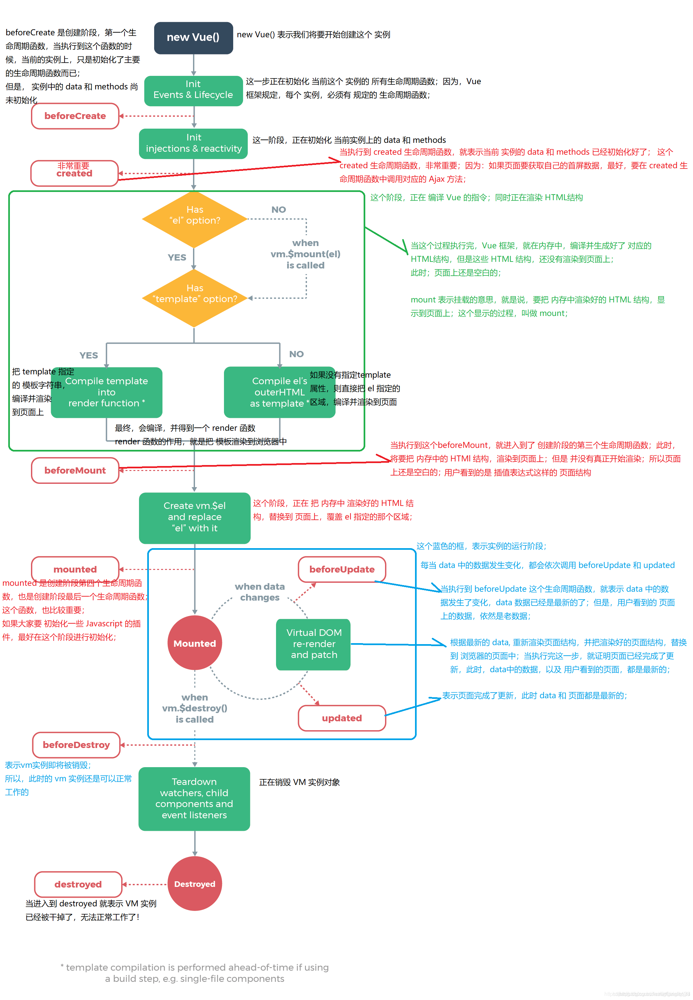
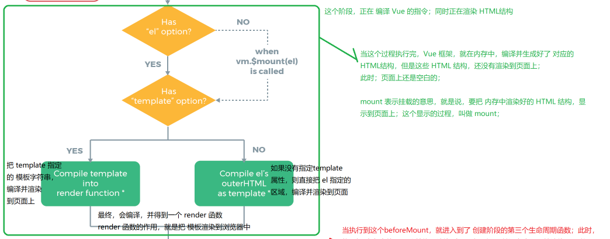
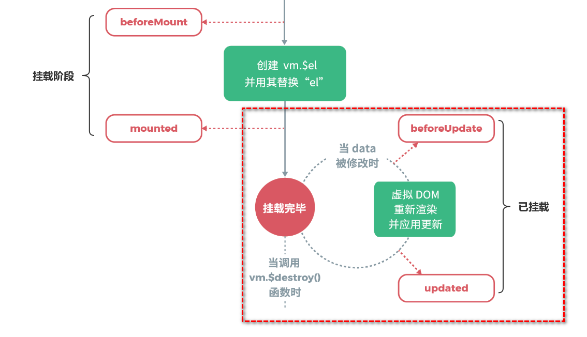
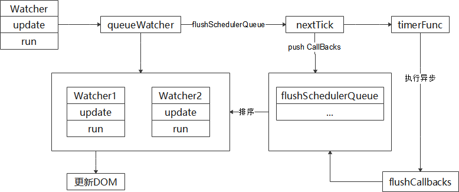
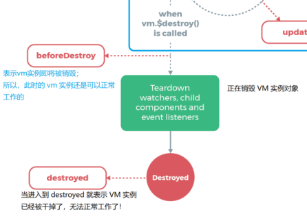

## **Vue 生命周期**

:::tip
资料整理: 黄晓妮      
更新日期: 2021-11-01
:::



生命周期流程图

### 1、**生命周期**

Vue 实例从创建到销毁的过程，根据流程图大致可以分为四个阶段：

初始化阶段：为 vue 实例上初始化一些属性，事件以及响应式数据；

模板编译阶段：将模板编译成渲染函数；

挂载阶段：将实例挂载到指定的 DOM 上，即将模板渲染到真实 DOM 中；

销毁阶段：将实例自身从父组件中删除，并取消依赖追踪及事件监听；

### 2、**生命周期函数（钩子）**

在生命周期中，特定的时间点会被自动执行的函数。

### 3、**初始化阶段**


创建一个 vue 实例:new vue() == >核心代码:this.\_init(options)，\_init 方法主要执行以下方法：

| 执行的方法                   | 简介                                                                                                                                                                                                                            |
| ---------------------------- | ------------------------------------------------------------------------------------------------------------------------------------------------------------------------------------------------------------------------------- |
| initLifecycle(vm)            | 初始化生命周期，其中定义了部分变量以及属性。主要设置$parent，$children，\$refs，\_watcher，isMounted，isDestroyed 等标志变量                                                                                                    |
| initEvents(vm)               | 初始化父组件绑定在实例上的事件以及事件的绑定(不是指 DOM 事件)。主要定义了$once、$off、$emit、$on                                                                                                                                |
| initRender(vm)               | 初始化与渲染相关的属性和方法，主要定义了 createElement 函数（生成虚拟 vnode）                                                                                                                                                   |
| callHook(vm, 'beforeCreate') | 执行 beforeCreate 生命周期                                                                                                                                                                                                      |
| initInjections(vm)           | 初始化实例中的 Inject 选项的                                                                                                                                                                                                    |
| initState(vm)                | 进行数据初始化，其中按照顺序初始化了 5 个选项，props、methods、data、computed、watch。并完成 data 数据劫持 observe 以及给从 computed、watch 配置 watcher 观察者实例，后续当数据发生变化时，才能感知到数据的变化并完成页面的渲染 |
| initProvide(vm)              | 将 provide 属性绑定到 provided 上。和 inject 成对出现，在 initState 后面运行的原因是 provide 可能会使用到 data、props、methods 等。                                                                                             |
| callHook(vm, 'created')      | 执行 creadted 生命周期函数，操作 data，methods 等最早只能在 created 生命周期函数                                                                                                                                                |

### 4、**模板编译阶段**



初始化阶段最后会判断当前是否有 el 参数，如果没有 el，我们会等待调用\$mount(el)方法。在有 el 参数的情况下，判断 template 参数前会先判断有无手写 render 函数，有存在 render 的话，则会直接去渲染当前的 render 函数，如果没有那么我们才开始去查找是否有 template 模板，如果没有 template，那么我们就会直接将获取到的 el（也就是我们常见的#app，#app 里面可能还会有其他标签）编译成 templae, 然后在将这个 template 转换成 render 函数。

```html
<div id="app">{{el}}</div>

<script>
    var app = new Vue({
        el: '#app',
        data: {
            el: '通过el渲染',
            template: '通过template渲染',
            render: '通过render渲染'
        },
        template: '<div>{{ template }}</div>',
        render(h) {
            return h('div', this.render);
        }
    });
    //页面呈现的是 通过render渲染
    //优先级 render -> template -> el
</script>
```

不管是用 el 还是 template 或者是我们常用的.vue 文件，最终都是转为 render 函数。

Vue 基于源码构建的版本有两个：1. 完整版 2. 只包含运行时版

两个版本的区别仅在于后者包含了一个编译器，拥有创建 vue 实例、渲染并处理虚拟 dom 等功能，使用 vue-loader 或 vueift 时，模板在构建时预编译成渲染函数，初始化阶段直接进入挂载阶段，模板编译阶段只存在于完整版。

### 5、**挂载阶段**



有了 render 渲染函数，触发 beforeMount 生命周期钩子函数，进入挂载阶段，执行了 updateComponent 函数。部分源码：

```js
callHook(vm, 'beforeMount');

let updateComponent;

updateComponent = function() {
    vm._update(vm._render(), hydrating);
};
```

从源码可以看到，在该函数内部，vm.\_render()内部会调用上述 render 函数，新生成一个虚拟 DOM。传递给组件 Vue.prototype.\_update 方法执行渲染到页面。

\_update 内部方法 patch，会根据是否存在旧的虚拟 DOM 来判断是首次渲染还是更新，如果存在对最新的虚拟 DOM 与上一次渲染的旧虚拟 DOM 进行对比并更新 DOM 节点。然后再开始将 render 渲染成为真实的 dom。渲染成真实 dom 后，会将渲染出来的真实 dom 替换掉原来的 vm.$el。然后再将替换后的$el 渲染到视图页面中。

如果是首次渲染，则会对这个 vnode 进行 patch 操作，帮我们把 vnode 通过 createElm 函数创建新节点并且渲染到 dom 节点中。

之后再执行 monut 生命周期函数，将标识生命周期的一个属性\_isMounted 置为 true。所以 mounted 函数内，我们是可以操作 dom 的，因为这个时候 dom 已经渲染完成了。

这时，挂载操作完成一半，挂在不仅要将模板渲染到视图中，同时还要开启对模板中数据（状态）的监控，当数据（状态）发生变化时通知其依赖进行视图更新。

```js
export function mountComponent(vm, el, hydrating) {
    vm.$el = el;
    if (!vm.$options.render) {
        vm.$options.render = createEmptyVNode;
    }
    callHook(vm, 'beforeMount');

    let updateComponent;

    updateComponent = () => {
        vm._update(vm._render(), hydrating);
    };
    new Watcher(
        vm,
        updateComponent,
        noop, {
            before() {
                if (vm._isMounted) {
                    callHook(vm, 'beforeUpdate');
                }
            }
        },
        true /* isRenderWatcher */
    );
    hydrating = false;

    if (vm.$vnode == null) {
        vm._isMounted = true;
        callHook(vm, 'mounted');
    }
    return vm;
}
```

从挂载的源码可以看出，创建了一个 Watcher 实例，并将定义好的 updateComponent 函数传入。要想开启对模板中数据（状态）的监控。

当我们状态数据发生变化时, 触发了 beforeUpdate 生命周期函数，要开始将我们变化后的数据渲染到页面上了（判断当前的\_isMounted 是不是为 ture 并且\_isDestroyed 是不是为 false，也就是说，保证 dom 已经被挂载的情况下，且当前组件并未被销毁，才会走 update 流程）。

beforeUpdate 调用之后，我们又会重新生成一个新的虚拟 dom(Vnode)，然后会拿这个最新的 Vnode 和原来的 Vnode 去做一个 diff 算，这里就涉及到一系列的计算，算出最小的更新范围，从而更新 render 函数中的最新数据，再将更新后的 render 函数渲染成真实 dom。也就完成了我们的数据更新

然后再执行 updated，所以 updated 里面也可以操作 dom，并拿到最新更新后的 dom。



mouted 和 updated 的执行，并不会等待所有子组件都被挂载完成后再执行，Vue 是异步执行 dom 更新的，一旦观察到数据变化，Vue 就会开启一个 Queue 队列，然后把在同一个事件循环 (event loop) 当中观察到数据变化的 watcher 推送进这个 Queue 队列。如果这个 watcher 被触发多次，只会被推送到队列一次。这种缓冲行为可以有效的去掉重复数据造成的不必要的计算和 DOm 操作。而在下一个事件循环时，Vue 会清空队列，并进行必要的 DOM 更新。

例如：

```
<template>
	<div>
		<ul ref="list">
			<li v-for="(item, index) in list" :key="index">{{ item }}</li>
		</ul>
		<button @click="additem">增加</button>
	</div>
</template>

<script>
export default {
	data() {
		return {
			list: ['第一个', '第二个', '第三个']
		};
	},
	methods: {
		additem() {
			this.list.push('加一个');
			this.list.push('加一个');
			this.list.push('加一个');

			let child = this.$refs.list.childNodes.length;
			console.log('list的长度:', child); //结果为3

			this.$nextTick(() => {
				let child = this.$refs.list.childNodes.length;
				console.log('list的长度:', child); //结果为6
			});
		}
	}
};
</script>
```

点击按钮的时候，列表循环出 6 个，但此时获取 dom 上的个数只能获取到 3，dom 还没进行更新。如果想要在修改数据后就获取 dom 更新后的状态，可以使用 this.\$nextTick 方法。

```
this.$nextTick():在下次 DOM 更新循环结束之后执行延迟回调。在修改数据之后立即使用这个方法，获取更新后的 DOM
```

### 6、**销毁阶段**



当调用了 vm.\$destroy 方法，Vue 实例就进入了销毁阶段，该阶段所做的主要工作是将当前的 Vue 实例从其父级实例中删除，取消当前实例上的所有依赖追踪并且移除实例上的所有事件监听器。

beforeDestroy 生命周期是实例销毁前，在这个函数内，还是可以操作实例的。

之后会做一系列的销毁动作，解除各种数据引用，移除事件监听，删除组件\_watcher，删除子实例，删除自身 self 等。同时将实例属性\_isDestroyed 置为 true

销毁完成后，再执行 destroyed，这时已经不能操作实例了。生命周期整个流程就结束了。

### **总结：**

| 生命周期      | 简介                                                                                                                                                                                                                                                                                                                                                                                      |
| ------------- | ----------------------------------------------------------------------------------------------------------------------------------------------------------------------------------------------------------------------------------------------------------------------------------------------------------------------------------------------------------------------------------------- |
| beforeCreated | 生成$options选项，并给实例添加生命周期相关属性。在实例初始化之后，在 数据观测(data observer) 和event/watcher 事件配置之前被调用，也就是说，data，watcher，methods都不存在这个阶段。但是有一个对象存在，那就是$route，因此此阶段就可以根据路由信息进行重定向等操作。                                                                                                                       |
| created       | 初始化与依赖注入相关的操作，会遍历传入 methods 的选项，初始化选项数据，从$options获取数据选项(vm.$options.data)，给数据添加‘观察器’对象并创建观察器，定义 getter、setter 存储器属性。在实例创建之后被调用，该阶段可以访问 data，使用 watcher、events、methods，也就是说 数据观测(data observer) 和 event/watcher 事件配置 已完成。但是此时 dom 还没有被挂载。该阶段允许执行 http 请求操作 |
| beforeMount   | 相关 render 函数首次被调用                                                                                                                                                                                                                                                                                                                                                                |
| mounted       | 在挂载完成之后被调用，执行 render 函数生成虚拟 dom，创建真实 dom 替换虚拟 dom，并挂载到实例。可以操作 dom，比如事件监听                                                                                                                                                                                                                                                                   |
| beforeUpdate  | $vm.data更新之后，虚拟dom重新渲染之前被调用。在这个钩子可以修改$vm.data，并不会触发附加的冲渲染过程。                                                                                                                                                                                                                                                                                     |
| updated       | 虚拟 dom 重新渲染后调用                                                                                                                                                                                                                                                                                                                                                                   |
| beforeDestroy | 实例被销毁前调用，也就是说在这个阶段还是可以调用实例的。                                                                                                                                                                                                                                                                                                                                  |
| destroyed     | 实例被销毁后调用，所有的事件监听器已被移除，子实例被销毁。                                                                                                                                                                                                                                                                                                                                |

### 7、**父子组件的生命周期加载顺序**

```js
// 子组件
Vue.component('child', {
    template: '<h1>child</h1>',
    props: ['message'],
    beforeCreate() {
        console.log('I am child beforeCreated');
    },
    created() {
        console.log('I am child created');
    },
    beforeMount() {
        console.log('I am child beforeMount');
    },
    mounted() {
        console.log(this.message); // null
        console.log('I am child mounted');
    }
});
// 父组件
new Vue({
    el: '#app',
    template: `
	<div id='parent'><child :message='message'></child></div>
  `,
    data: {
        message: null
    },
    beforeCreate() {
        console.log('I am parents beforeCreated');
    },
    created() {
        console.log('I am parents created');
    },
    beforeMount() {
        console.log('I am parents beforeMount');
    },
    mounted() {
        this.message = 'this is message';
        console.log('I am parents mounted');
    }
});
```

分别在他们的钩子函数中打印日志，观察执行顺序。得到的结果如下，父组件先创建，然后子组件创建；子组件先挂载，然后父组件挂载。

```
"I am parents beforeCreated"
"I am parents created"
"I am parents beforeMount"
"I am child beforeCreated"
"I am child created"
"I am child beforeMount"
null
"I am child mounted"
"I am parents mounted"
```

可以看到在子组件 mouted 中打印出来的是 null；子组件挂载完成后，父组件还未挂载。所以组件数据回显的时候，在父组件 mounted 中获取的数据，子组件的 mounted 是拿不到的。

**加载渲染过程：**

父 beforeCreate->父 created->父 beforeMount->子 beforeCreate->子 created->子 beforeMount->子 mounted->父 mounted

**更新过程：**

父 beforeUpdate->子 beforeUpdate->子 updated->父 updated

**销毁过程：**

父 beforeDestroy->子 beforeDestroy->子 destroyed->父 destroyed

**父子组件的生命周期加载顺序根据生命周期流程图也能理解，首先父组件先创建才能再创建子组件，子组件在父组件内，得先更新挂载完，父组件才算全部挂载完，销毁时如果父组件先销毁，会造成内层泄露。**

### 8、**优化**

**（1）自定义事件、定时器等任务及时销毁（可以在 beforeDestory 中），避免内层泄露；**

清理定时器有两种方法：

方法一：定时器的方法或者生命周期函数中声明并销毁

1. 首先在 vue 实例的 data 中定义定时器的名称：
    

```
    export default {
    	data() {
    		timer: null;
    	}
    };
    ```

2) 在方法（methods）或者页面初始化（mounted()）的时候使用定时器

    

```
    this.timer = setInterval(() => {
    	//需要做的事情
    }, 1000);
    ```

3. 然后在页面销毁的生命周期函数（beforeDestroy()）中销毁定时器
    

```
    export default {
    	data() {
    		timer: null;
    	},

    	beforeDestroy() {
    		clearInterval(this.timer);

    		this.timer = null;
    	}
    };
    ```

方法二：使用 this.\$once(‘hook:beforeDestory’, ()=>{}); 直接在需要定时器的方法或者生命周期函数中声明并销毁

```
export default {
	methods: {
		fun1() {
			const timer = setInterval(() => {
				//需要做的事情
			}, 1000);

			this.$once('hook:beforeDestroy', () => {
				clearInterval(timer);

				timer = null;
			});
		}
	}
};
```

方法一存在的问题：
（1）vue 实例中需要有这个定时器的实例，感觉有点多余; 

（2）创建的定时器代码和销毁定时器的代码没有放在一起，通常很容易忘记去清理这个定时器，不容易维护; 

因此推荐用方法二

**（2）父子组件请求是异步的**

在父组件调用接口传递数据给子组件时，请求接口响应是异步的。在父组件哪个钩子发请求，在子组件哪个钩子接收数据。都有可能取不到的。当子组件的 mounted 都执行完之后，此时可能父组件的请求才返回数据。会导致，从父组件传递给子组件的数据是 undefined。

解决方法一：

```html
<div class="test">
    <children v-if="data1" :data="data1"></children>
</div>
```

在渲染子组件的时候加上一个条件, data1 是父组件调用接口返回的数据。当有数据的时候在去渲染子组件。这样就会形成天然的阻塞。在父组件的 created 中的请求返回数据后，才会执行子组件的 created，mounted。最后执行父组件的 mounted。

解决方法二：

在子组件中 watch 监听，父组件获取到值，这个值就会变化，自然是可以监听到的

```js
watch: {

    data: {

        deep: true,

        handler: function(newVal, oldVal) {
            this.$nextTick(() => {

                this.data = newVal

                this.data = newVal.url ? newVal.url : ''

            })

        }

    },

}
```

从父组件点击调用接口并显示子组件，子组件拿到数据并监听在 watch 中调用方法并显示

```js
props: ['data1'],

    watch: {

        data1: {

            deep: true,

            handler: function(newVal, oldVal) {

                this.$nextTick(() => {

                    this.data1 = newVal

                    this.showData1(this.data1)

                })

            }

        },

    }
```

**（3）避免在 updated 更改状态，因为这可能会导致更新无限循环。**

虚拟 dom 重新渲染后调用，若再次修改\$vm.data，会再次触发 beforeUpdate、updated，进入死循环。

**（4）v-if 与 v-show**

这两个指令都可以把元素隐藏或显示。当传入的数据是 true 是展示，false 会隐藏。

不同的是：v-if 会把元素或者组件删掉（不渲染），即在 DOM 中移除；v-show 则会使用 CSS 当中的 display 属性，将其设置成 none。v-if 是真正的条件渲染，因为它会确保在切换过程中条件块内的事件监听器和子组件适当地被销毁和重建；也是惰性的：如果在初始渲染时条件为假，则什么也不做——直到条件第一次变为真时，才会开始渲染条件块。

v-if 适用于在运行时很少改变条件，不需要频繁切换条件的场景；v-show 则适用于需要非常频繁切换条件的场景。

**（5）KEY 的重要性**

使用 v-for 更新已渲染的元素列表时，默认用就地复用策略；列表数据修改的时候，他会根据 key 值去判断某个值是否修改，如果修改，则重新渲染这一项, 否则复用之前的元素；

在循环中应使用 key，且最好不要是 index 或者 random。diff 算法中通过 tag 和 key 来判断是否是同一个节点（sameNode），使用 key 可以减少渲染次数，提高渲染性能。

---

**为什么不用 index 或者 random 作为 key**

diff 算法过程中，会对比新旧节点是否相同类型的节点。

如果渲染的列表会被改变，用 index 作为 key，数组的顺序怎么改变，index 都是 0, 1, 2 这样排列的，在对比新旧节点时，复用不了，就会重新渲染。同理，random 随机数作为 key，在对比时也找不到相同，复用不了，重新渲染。
