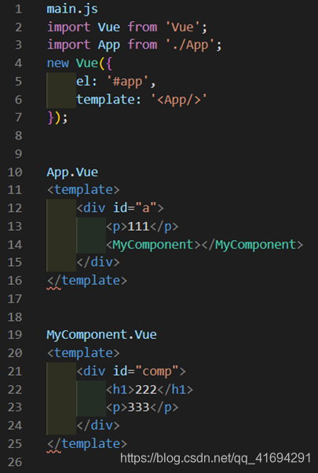
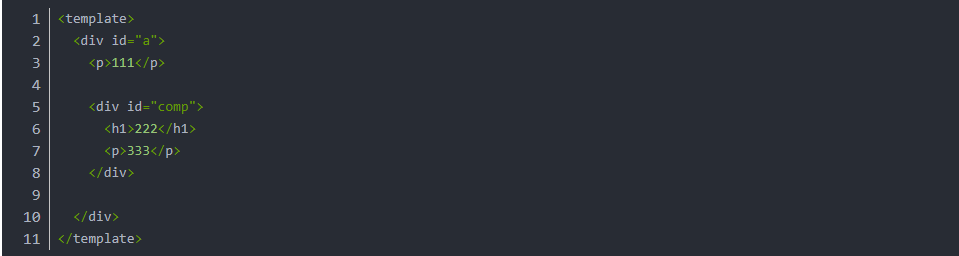
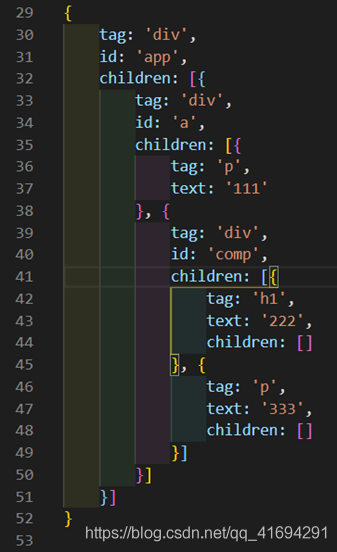
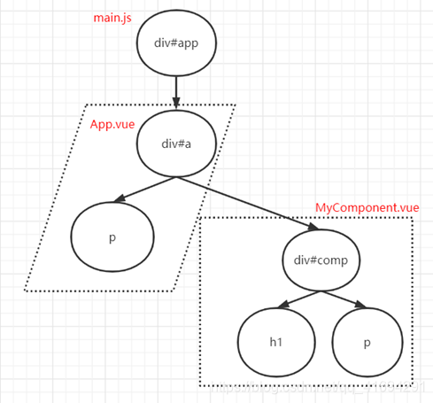
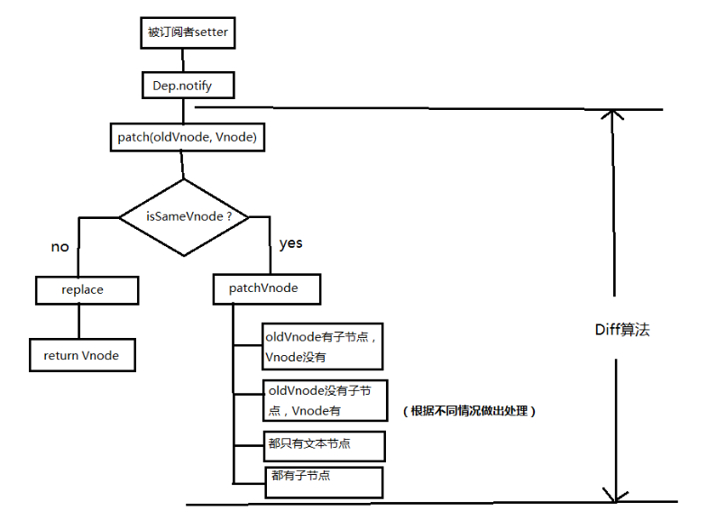
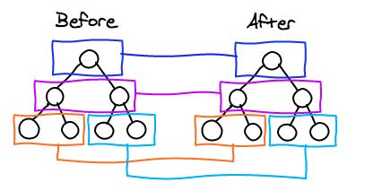
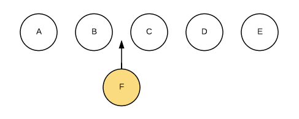
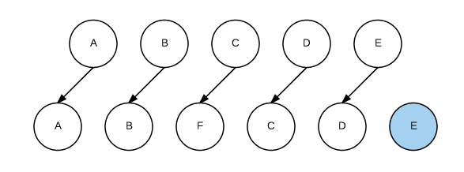
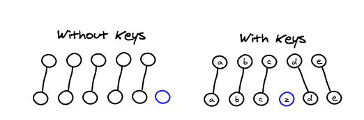

 **Vue的渲染机制**
:::tip
资料整理: 崔渝   
更新日期: 2021-11-15
:::
**一、Vue的渲染是在生命周期哪个阶段完成？**

生命周期流程图：


从图中我们可以看到， `Vue` 实例的生命周期大致可分为4个阶段：

* 初始化阶段：为`Vue`实例上初始化一些属性，事件以及响应式数据；
* **模板编译阶段：将模板编译成渲染函数；**
* **挂载阶段：将实例挂载到指定的`DOM`上，即将模板渲染到真实`DOM`中；**
* 销毁阶段：将实例自身从父组件中删除，并取消依赖追踪及事件监听器；

**二、渲染流程**


​	渲染流程，就是把用户写的类似于原生 `HTML` 的模板经过一系列处理最终反应到视图中称之为整个渲染流程，从图中我们也可以看到，模板编译过程就是把用户写的模板经过一系列处理最终生成 `render` 函数的过程。

**三、模板编译**

**1、用户写的模板**

我们先来打通HTML与Vue模板的关系。



​	整个Vue应用被挂载到页面上id为app的节点上，传入的模板字符串是<App/>。Vue会解析组件App的模板来替换该标签。在解析App的模板时发现它又引入了另一个组件MyComponent，于是Vue继续解析MyComponent的模板，将解析结果替换到App组件模板内。全部解析之后会得到这样一个模板：



​	这并不是HTML代码，它仍然是Vue模板（只是这里没有定义数据绑定而已）。Vue会用纯JavaScript来描述上述结构，类似下面这样（这不是真正的内部表示，后面我们会看到Vue的真实内部表示）：



​	这里最外部id为app的节点实际上是不存在的，Vue在生成DOM时会替换掉该元素。

​	我们看到，Vue用一个JavaScript对象描述了编译出来的模板（如果有数据绑定，它还会描述模板与数据的绑定关系）。接下来只需要调用原生的DOM方法依次创建这里的每一个节点，然后将它们挂载成一棵DOM子树，并插入页面，就可以得到真正的HTML。我们一般把这个树状JavaScript对象称为虚拟DOM树。下面是上面的JavaScript对象对应的DOM结构：



​	也就是说，通过模板可以得到真实HTML的JavaScript对象表示，然后调用原生的DOM方法，借助这个JavaScript对象去生成真实的HTML。

这里提出一个问题，方便大家理解：Vue实例只能有一个根元素，为什么要求组件模板也只能有一个根元素？

​	如果我们尝试在template标签下写两个div，那么编辑器会提示我们 `The template root requires exactly one element` 。那这里为什么template下也必须有且只能有一个div呢？

这里我们要先看一看template这个标签，这个标签是HTML5出来的新标签，它有三个特性：

1. 隐藏性：该标签不会显示在页面的任何地方，即便里面有多少内容，它永远都是隐藏的状态；
2. 任意性：该标签可以写在页面的任何地方，甚至是head、body、sciprt标签内；
3. 无效性：该标签里的任何HTML内容都是无效的，不会起任何作用；

但是我们可以通过innerHTML来获取到里面的内容。

知道了这个，我们再来看.vue的单文件组件。其实本质上，一个单文件组件会被各种各样的loader处理成为.js文件（因为当你import一个单文件组件并打印出来的时候，是一个vue实例），通过template的任意性我们知道，template包裹的HTML可以写在任何地方，那么对于一个.vue来讲，这个template里面的内容就是会被vue处理为虚拟dom并渲染的内容，导致结果又回到了开始 ：既然一个.vue单文件组件是一个vue实例，那么这个实例的入口在哪里？

如果在template下有多个div，那么该如何指定这个vue实例的根入口？
为了让组件能够正常的生成一个vue实例，那么这个div会被自然的处理成程序的入口。

通过这个‘根节点’，来递归遍历整个vue‘树’下的所有节点，并处理为vdom，最后再渲染成真正的HTML，插入在正确的位置。

**2、模板编译**

**1）什么是模板编译？**

​	在日常开发中，我们把写在 `<template></template>` 标签中的类似于原生 `HTML` 的内容称之为模板。这时你可能会问了，为什么说是“类似于原生 `HTML` 的内容”而不是“就是 `HTML` 的内容”？因为我们在开发中，在 `<template></template>` 标签中除了写一些原生 `HTML` 的标签，我们还会写一些变量插值，如，或者写一些 `Vue` 指令，如 `v-on` 、 `v-if` 等。而这些东西都是在原生 `HTML` 语法中不存在的，不被接受的。我们把用户在 `<template></template>` 标签中写的类似于原生 `HTML` 的内容进行编译，把原生 `HTML` 的内容找出来，再把非原生 `HTML` 找出来，经过一系列的逻辑处理生成渲染函数，也就是 `render` 函数的这一段过程称之为模板编译过程。

**2）模板编译内部流程**

那么模板编译内部是怎么把用户写的模板经过处理最终生成 `render` 函数的呢？这内部的过程是怎样的呢？

**2.1）抽象语法树（AST）**

​	我们知道，用户在 `<template></template>` 标签中写的模板对 `Vue` 来说就是一堆字符串，那么如何解析这一堆字符串并且从中提取出元素的标签、属性、变量插值等有效信息呢？这就需要借助一个叫做抽象语法树的东西。

​	


​	从图中我们可以看到，一个简单的 `HTML` 标签的代码被转换成了一个 `JS` 对象，而这个对象中的属性代表了这个标签中一些关键有效信息。如图中标识。 有兴趣的同学可以在这个网站在线转换试试：https://astexplorer.net/

​	

**2.2）具体流程**

​	将一堆字符串模板解析成抽象语法树 `AST` 后，我们就可以对其进行各种操作处理了，处理完后用处理后的 `AST` 来生成 `render` 函数。其具体流程可大致分为三个阶段：	

1. 模板解析阶段：将一堆模板字符串用正则等方式解析成抽象语法树`AST`；
2. 优化阶段：遍历`AST`，找出其中的静态节点，并打上标记；
3. 代码生成阶段：将`AST`转换成渲染函数；

这三个阶段在源码中分别对应三个模块，下面给出三个模块的源代码在源码中的路径：

1. 模板解析阶段——解析器——源码路径：`src/compiler/parser/index.js`;
2. 优化阶段——优化器——源码路径：`src/compiler/optimizer.js`;
3. 代码生成阶段——代码生成器——源码路径：`src/compiler/codegen/index.js`; 

下面再给出模板编译内部具体流程图，便于理解。流程图如下：


**2.3）模板解析阶段（解析器）**

​	解析器，顾名思义，就是把用户所写的模板根据一定的解析规则解析出有效的信息，最后用这些信息形成 `AST` 。我们知道在 `<template></template>` 模板内，除了有常规的 `HTML` 标签外，用户还会一些文本信息以及在文本信息中包含过滤器。而这些不同的内容在解析起来肯定需要不同的解析规则，所以解析器不可能只有一个，它应该除了有解析常规 `HTML` 的**HTML解析器**，还应该有解析文本的**文本解析器**以及解析文本中如果包含过滤器的**过滤器解析器**。

​	另外，文本信息和标签属性信息却又是存在于HTML标签之内的，所以在解析整个模板的时候它的流程应该是这样子的：HTML解析器是主线，先用HTML解析器进行解析整个模板，在解析过程中如果碰到文本内容，那就调用文本解析器来解析文本，如果碰到文本中包含过滤器那就调用过滤器解析器来解析。如下图所示：


​	在源码中， `HTML` 解析器就是 `parseHTML` 函数，在模板解析主线函数 `parse` 中调用了该函数，并传入两个参数，代码如下：

```javascript
// 代码位置：/src/complier/parser/index.js

/**
 * Convert HTML string to AST.
 * 将HTML模板字符串转化为AST
 */
export function parse(template, options) {
    // ...
    parseHTML(template, {
        warn,
        expectHTML: options.expectHTML,
        isUnaryTag: options.isUnaryTag,
        canBeLeftOpenTag: options.canBeLeftOpenTag,
        shouldDecodeNewlines: options.shouldDecodeNewlines,
        shouldDecodeNewlinesForHref: options.shouldDecodeNewlinesForHref,
        shouldKeepComment: options.comments,
        // 当解析到开始标签时，调用该函数
        start(tag, attrs, unary) {

        },
        // 当解析到结束标签时，调用该函数
        end() {

        },
        // 当解析到文本时，调用该函数
        chars(text) {

        },
        // 当解析到注释时，调用该函数
        comment(text) {

        }
    })
    return root
}
```

从代码中我们可以看到，调用 `parseHTML` 函数时为其传入的两个参数分别是：

* template: 待转换的模板字符串；
* options: 转换时所需的选项；

第一个参数是待转换的模板字符串，无需多言；重点看第二个参数，第二个参数提供了一些解析 `HTML` 模板时的一些参数，同时还定义了4个钩子函数。这4个钩子函数有什么作用呢？我们说了模板编译阶段主线函数 `parse` 会将 `HTML` 模板字符串转化成 `AST` ，而 `parseHTML` 是用来解析模板字符串的，把模板字符串中不同的内容出来之后，那么谁来把提取出来的内容生成对应的 `AST` 呢？答案就是这4个钩子函数。

把这4个钩子函数作为参数传给解析器 `parseHTML` ，当解析器解析出不同的内容时调用不同的钩子函数从而生成不同的 `AST` 。

当解析到开始标签时调用 `start` 函数生成元素类型的 `AST` 节点，代码如下：

```javascript
// 当解析到标签的开始位置时，触发start
start(tag, attrs, unary) {
    let element = createASTElement(tag, attrs, currentParent)
}

export function createASTElement(tag, attrs, parent) {
    return {
        type: 1,
        tag,
        attrsList: attrs,
        attrsMap: makeAttrsMap(attrs),
        parent,
        children: []
    }
}
```

* 从上面代码中我们可以看到，`start`函数接收三个参数，分别是标签名`tag`、标签属性`attrs`、标签是否自闭合`unary`。当调用该钩子函数时，内部会调用`createASTElement`函数来创建元素类型的`AST`节点
* 当解析到结束标签时调用`end`函数；
* 当解析到文本时调用`chars`函数生成文本类型的`AST`节点；

```javascript
// 当解析到标签的文本时，触发chars
chars(text) {
    if (text是带变量的动态文本) {
        let element = {
            type: 2,
            expression: res.expression,
            tokens: res.tokens,
            text
        }
    } else {
        let element = {
            type: 3,
            text
        }
    }
}
```

* 当解析到标签的文本时，触发`chars`钩子函数，在该钩子函数内部，首先会判断文本是不是一个带变量的动态文本，如“hello ”。如果是动态文本，则创建动态文本类型的`AST`节点；如果不是动态文本，则创建纯静态文本类型的`AST`节点。
* 当解析到注释时调用`comment`函数生成注释类型的`AST`节点；

```javascript
// 当解析到标签的注释时，触发comment
comment(text: string) {
    let element = {
        type: 3,
        text,
        isComment: true
    }
}
```

* 当解析到标签的注释时，触发`comment`钩子函数，该钩子函数会创建一个注释类型的`AST`节点。

一边解析不同的内容一边调用对应的钩子函数生成对应的 `AST` 节点，最终完成将整个模板字符串转化成 `AST` , 这就是 `HTML` 解析器所要做的工作。

**HTML解析器源码：**

```javascript
function parseHTML(html, options) {
    var stack = [];
    var expectHTML = options.expectHTML;
    var isUnaryTag$$1 = options.isUnaryTag || no;
    var canBeLeftOpenTag$$1 = options.canBeLeftOpenTag || no;
    var index = 0;
    var last, lastTag;

    // 开启一个 while 循环，循环结束的条件是 html 为空，即 html 被 parse 完毕
    while (html) {
        last = html;
        // 确保即将 parse 的内容不是在纯文本标签里 (script,style,textarea)
        if (!lastTag || !isPlainTextElement(lastTag)) {
            let textEnd = html.indexOf('<')
            /**
             * 如果html字符串是以'<'开头,则有以下几种可能
             * 开始标签:<div>
             * 结束标签:</div>
             * 注释:<!-- 我是注释 -->
             * 条件注释:<!-- [if !IE] --> <!-- [endif] -->
             * DOCTYPE:<!DOCTYPE html>
             * 需要一一去匹配尝试
             */
            if (textEnd === 0) {
                // 解析是否是注释
                if (comment.test(html)) {

                }
                // 解析是否是条件注释
                if (conditionalComment.test(html)) {

                }
                // 解析是否是DOCTYPE
                const doctypeMatch = html.match(doctype)
                if (doctypeMatch) {

                }
                // 解析是否是结束标签
                const endTagMatch = html.match(endTag)
                if (endTagMatch) {

                }
                // 匹配是否是开始标签
                const startTagMatch = parseStartTag()
                if (startTagMatch) {

                }
            }
            // 如果html字符串不是以'<'开头,则解析文本类型
            let text, rest, next
            if (textEnd >= 0) {

            }
            // 如果在html字符串中没有找到'<'，表示这一段html字符串都是纯文本
            if (textEnd < 0) {
                text = html
                html = ''
            }
            // 把截取出来的text转化成textAST
            if (options.chars && text) {
                options.chars(text)
            }
        } else {
            // 父元素为script、style、textarea时，其内部的内容全部当做纯文本处理
        }

        //将整个字符串作为文本对待
        if (html === last) {
            options.chars && options.chars(html);
            if (!stack.length && options.warn) {
                options.warn(("Mal-formatted tag at end of template: \"" + html + "\""));
            }
            break
        }
    }

    // Clean up any remaining tags
    parseEndTag();
    //parse 开始标签
    function parseStartTag() {

    }
    //处理 parseStartTag 的结果
    function handleStartTag(match) {

    }
    //parse 结束标签
    function parseEndTag(tagName, start, end) {

    }
}
```

上述代码中大致可分为三部分：

* 定义的一些常量和变量
* while 循环
* 解析过程中用到的辅助函数

我们一一来分析：

首先定义了几个常量，如下

```javascript
const stack = [] // 维护AST节点层级的栈
const expectHTML = options.expectHTML
const isUnaryTag = options.isUnaryTag || no
const canBeLeftOpenTag = options.canBeLeftOpenTag || no //用来检测一个标签是否是可以省略闭合标签的非自闭合标签
let index = 0 //解析游标，标识当前从何处开始解析模板字符串
let last, // 存储剩余还未解析的模板字符串
    lastTag // 存储着位于 stack 栈顶的元素
```

接着开启 `while` 循环，循环的终止条件是 模板字符串 `html` 为空，即模板字符串被全部编译完毕。在每次 `while` 循环中， 先把 `html` 的值赋给变量 `last` ，如下：

```javascript
last = html
```

这样做的目的是，如果经过上述所有处理逻辑处理过后， `html` 字符串没有任何变化，即表示 `html` 字符串没有匹配上任何一条规则，那么就把 `html` 字符串当作纯文本对待，创建文本类型的 `AST` 节点并且如果抛出异常：模板字符串中标签格式有误。如下：

```javascript
//将整个字符串作为文本对待
if (html === last) {
    options.chars && options.chars(html);
    if (!stack.length && options.warn) {
        options.warn(("Mal-formatted tag at end of template: \"" + html + "\""));
    }
    break
}
```

接着，我们继续看 `while` 循环体内的代码：

```javascript
while (html) {
    // 确保即将 parse 的内容不是在纯文本标签里 (script,style,textarea)
    if (!lastTag || !isPlainTextElement(lastTag)) {

    } else {
        // parse 的内容是在纯文本标签里 (script,style,textarea)
    }
}
```

在循环体内，首先判断了待解析的 `html` 字符串是否在纯文本标签里，如 `script` , `style` , `textarea` ，因为在这三个标签里的内容肯定不会有 `HTML` 标签，所以我们可直接当作文本处理，判断条件如下：

```javascript
!lastTag || !isPlainTextElement(lastTag)
```

前面我们说了， `lastTag` 为栈顶元素， `!lastTag` 即表示当前 `html` 字符串没有父节点，而 `isPlainTextElement(lastTag)` 是检测 `lastTag` 是否为是那三个纯文本标签之一，是的话返回 `true` ，不是返回 `fasle` 。

也就是说当前 `html` 字符串要么没有父节点要么父节点不是纯文本标签，则接下来就可以依次解析那6种类型的内容了。

**如何保证AST节点层级关系？（需要了解的问题）**

​	关于这个问题， `Vue` 也注意到了。 `Vue` 在 `HTML` 解析器的开头定义了一个栈 `stack` ，这个栈的作用就是用来维护 `AST` 节点层级的，那么它是怎么维护的呢？通过前文我们知道， `HTML` 解析器在从前向后解析模板字符串时，每当遇到开始标签时就会调用 `start` 钩子函数，那么在 `start` 钩子函数内部我们可以将解析得到的开始标签推入栈中，而每当遇到结束标签时就会调用 `end` 钩子函数，那么我们也可以在 `end` 钩子函数内部将解析得到的结束标签所对应的开始标签从栈中弹出。请看如下例子：

加入如下模板字符串：

```html
<div>
    <p><span></span></p>
</div>
```

​	当解析到开始标签 `<div>` 时，就把 `div` 推入栈中，然后继续解析，当解析到 `<p>` 时，再把 `p` 推入栈中，同理，再把 `span` 推入栈中，当解析到结束标签 `</span>` 时，此时栈顶的标签刚好是 `span` 的开始标签，那么就用 `span` 的开始标签和结束标签构建 `AST` 节点，并且从栈中把 `span` 的开始标签弹出，那么此时栈中的栈顶标签 `p` 就是构建好的 `span` 的 `AST` 节点的父节点，如下图：


​	这样我们就找到了当前被构建节点的父节点。这只是栈的一个用途，它还有另外一个用途，我们再看如下模板字符串：

```html
<div>
    <p><span></p>
</div>
```

​	按照上面的流程解析这个模板字符串时，当解析到结束标签 `</p>` 时，此时栈顶的标签应该是 `p` 才对，而现在是 `span` ，那么就说明 `span` 标签没有被正确闭合，此时控制台就会抛出警告：‘tag has no matching end tag.’相信这个警告你一定不会陌生。这就是栈的第二个用途： 检测模板字符串中是否有未正确闭合的标签。

**2.4）优化阶段（优化器）**

​	在前面，我们介绍了模板编译流程三大阶段中的第一阶段模板解析阶段，在这一阶段主要做的工作是用解析器将用户所写的模板字符串解析成 `AST` 抽象语法树，理论上来讲，有了 `AST` 就可直接进入第三阶段生成 `render` 函数了。其实不然， `Vue` 还是很看重性能的，只要有一点可以优化的地方就要将其进行优化。在后面我们介绍虚拟 `DOM` 的时候会讲到有一种节点一旦首次渲染上了之后不管状态再怎么变化它都不会变了，这种节点叫做**静态节点**，如下：

```html
<ul>
    <li>我是文本信息</li>
    <li>我是文本信息</li>
    <li>我是文本信息</li>
    <li>我是文本信息</li>
    <li>我是文本信息</li>
</ul>
```

​	在上面代码中， `ul` 标签下面有5个 `li` 标签，每个 `li` 标签里的内容都是不含任何变量的纯文本，也就是说这种标签一旦第一次被渲染成 `DOM` 节点以后，之后不管状态再怎么变化它都不会变了，我们把像 `li` 的这种节点称之为静态节点。而这5个 `li` 节点的父节点是 `ul` 节点，也就是说 `ul` 节点的所有子节点都是静态节点，那么我们把像 `ul` 的这种节点称之为**静态根节点**。

​	OK，有了**静态节点**和**静态根节点**这两个概念之后，我们再仔细思考，模板编译的最终目的是用模板生成一个 `render` 函数，而用 `render` 函数就可以生成与模板对应的 `VNode` ，之后再进行 `patch` 算法，最后完成视图渲染。这中间的 `patch` 算法又是用来对比新旧 `VNode` 之间存在的差异。在上面我们还说了，静态节点不管状态怎么变化它是不会变的，基于此，那我们就可以在 `patch` 过程中不用去对比这些静态节点了，这样不就又可以提高一些性能了。

​	所以我们在模板编译的时候就先找出模板中所有的静态节点和静态根节点，然后给它们打上标记，用于告诉后面 `patch` 过程打了标记的这些节点是不需要对比的，你只要把它们克隆一份去用就好啦。这就是优化阶段存在的意义。

优化阶段其实就干了两件事：

1. **在`AST`中找出所有静态节点并打上标记；**
2. **在`AST`中找出所有静态根节点并打上标记；**

优化阶段的源码位于 `src/compiler/optimizer.js` 中，如下：

```javascript
export function optimize(root: ? ASTElement, options : CompilerOptions) {
    if (!root) return
    isStaticKey = genStaticKeysCached(options.staticKeys || '')
    isPlatformReservedTag = options.isReservedTag || no
    // 标记静态节点
    markStatic(root)
    // 标记静态根节点
    markStaticRoots(root, false)
}
```

具体实现源码如下：（感兴趣的小伙伴可以深入理解！）

标记静态节点：从根节点开始，先标记根节点是否为静态节点，然后看根节点如果是元素节点，那么就去向下递归它的子节点，子节点如果还有子节点那就继续向下递归，直到标记完所有节点。

```javascript
function markStatic(node: ASTNode) {
    node.static = isStatic(node)
    if (node.type === 1) {
        // do not make component slot content static. this avoids
        // 1. components not able to mutate slot nodes
        // 2. static slot content fails for hot-reloading
        if (
            !isPlatformReservedTag(node.tag) &&
            node.tag !== 'slot' &&
            node.attrsMap['inline-template'] == null
        ) {
            return
        }
        for (let i = 0, l = node.children.length; i < l; i++) {
            const child = node.children[i]
            markStatic(child)
            if (!child.static) {
                node.static = false
            }
        }
        if (node.ifConditions) {
            for (let i = 1, l = node.ifConditions.length; i < l; i++) {
                const block = node.ifConditions[i].block
                markStatic(block)
                if (!block.static) {
                    node.static = false
                }
            }
        }
    }
}
```

标记静态根节点：寻找静态根节点根寻找静态节点的逻辑类似，都是从 `AST` 根节点递归向下遍历寻找。

```javascript
function markStaticRoots(node: ASTNode, isInFor: boolean) {
    if (node.type === 1) {
        if (node.static || node.once) {
            node.staticInFor = isInFor
        }
        // For a node to qualify as a static root, it should have children that
        // are not just static text. Otherwise the cost of hoisting out will
        // outweigh the benefits and it's better off to just always render it fresh.
        if (node.static && node.children.length && !(
                node.children.length === 1 &&
                node.children[0].type === 3
            )) {
            node.staticRoot = true
            return
        } else {
            node.staticRoot = false
        }
        if (node.children) {
            for (let i = 0, l = node.children.length; i < l; i++) {
                markStaticRoots(node.children[i], isInFor || !!node.for)
            }
        }
        if (node.ifConditions) {
            for (let i = 1, l = node.ifConditions.length; i < l; i++) {
                markStaticRoots(node.ifConditions[i].block, isInFor)
            }
        }
    }
}
```

**3、代码生成阶段（2.5、代码生成器）（生成render渲染函数）**

​	经过之前的讲解，我们把用户所写的模板字符串先经过解析阶段解析生成对应的抽象语法树 `AST` ，接着再经过优化阶段将 `AST` 中的静态节点及静态根节点都打上标记，现在终于到了模板编译三大阶段的最后一个阶段了——代码生成阶段。所谓代码生成阶段，到底是要生成什么代码？答：要生成 `render` 函数字符串。

​	我们知道， `Vue` 实例在挂载的时候会调用其自身的 `render` 函数来生成实例上的 `template` 选项所对应的 `VNode` ，简单的来说就是 `Vue` 只要调用了 `render` 函数，就可以把模板转换成对应的虚拟 `DOM` 。那么 `Vue` 要想调用 `render` 函数，那必须要先有这个 `render` 函数，那这个 `render` 函数又是从哪来的呢？是用户手写的还是 `Vue` 自己生成的？答案是都有可能。我们知道，我们在日常开发中是可以在 `Vue` 组件选项中手写一个 `render` 选项，其值对应一个函数，那这个函数就是 `render` 函数，当用户手写了 `render` 函数时，那么 `Vue` 在挂载该组件的时候就会调用用户手写的这个 `render` 函数。那如果用户没有写呢？那这个时候 `Vue` 就要自己根据模板内容生成一个 `render` 函数供组件挂载的时候调用。而 `Vue` 自己根据模板内容生成 `render` 函数的过程就是本篇文章所要介绍的代码生成阶段。

​	**所谓代码生成其实就是根据模板对应的抽象语法树 `AST` 生成一个函数，通过调用这个函数就可以得到模板对应的虚拟 `DOM` 。**

**如何根据AST生成render函数？**

假设现有如下模板：

```html
<div id="NLRX">
    <p>Hello {{name}}</p>
</div>
```

该模板经过解析并优化后对应的 `AST` 如下：

```javascript
ast = {
    'type': 1,
    'tag': 'div',
    'attrsList': [{
        'name': 'id',
        'value': 'NLRX',
    }],
    'attrsMap': {
        'id': 'NLRX',
    },
    'static': false,
    'parent': undefined,
    'plain': false,
    'children': [{
        'type': 1,
        'tag': 'p',
        'plain': false,
        'static': false,
        'children': [{
            'type': 2,
            'expression': '"Hello "+_s(name)',
            'text': 'Hello {{name}}',
            'static': false,
        }]
    }]
}
```

​	生成 `render` 函数的过程其实就是一个递归的过程，从顶向下依次递归 `AST` 中的每一个节点，根据不同的 `AST` 节点类型创建不同的 `VNode` 类型。

​	首先，根节点 `div` 是一个元素型 `AST` 节点，那么我们就要创建一个元素型 `VNode` ，我们把创建元素型 `VNode` 的方法叫做 `_c(tagName, data, children)` 。我们暂且不管 `_c()` 是什么，只需知道调用 `_c()` 就可以创建一个元素型 `VNode` 。那么就可以生成如下代码：

```javascript
_c('div', {
    attrs: {
        "id": "NLRX"
    }
}, [ /*子节点列表*/ ])
```

​	根节点 `div` 有子节点，那么我们进入子节点列表 `children` 里遍历子节点，发现子节点 `p` 也是元素型的，那就继续创建元素型 `VNode` 并将其放入上述代码中根节点的子节点列表中，如下：

```javascript
_c('div', {
    attrs: {
        "id": "NLRX"
    }
}, [_c('p'), [ /*子节点列表*/ ]])
```

​	同理，继续遍历 `p` 节点的子节点，发现是一个文本型节点，那就创建一个文本型 `VNode` 并将其插入到 `p` 节点的子节点列表中，同理，创建文本型 `VNode` 我们调用 `_v()` 方法，如下：

```javascript
_c('div', {
    attrs: {
        "id": "NLRX"
    }
}, [_c('p'), [_v("Hello " + _s(name))]])
```

​	到此，整个 `AST` 就遍历完毕了，我们将得到的代码再包装一下，如下：

```javascript
`
with(this){
    reurn _c(
        'div',
        {
            attrs:{"id":"NLRX"},
        }
        [
            _c('p'),
            [
                _v("Hello "+_s(name))
            ]
        ])
}
`
```

​	我们看上面示例生成的JavaScript字符串，会发现里面会有 `_v` 、 `_c` 、 `_s` 这样的东西，这些其实就是Vue内部定义的一些调用方法。

其中 `_c` 函数定义在 `src/core/instance/render.js` 中。

```vuejs
  vm.$slots = resolveSlots(options._renderChildren, renderContext)
  vm.$scopedSlots = emptyObject
  // 定义的_c函数是用来创建元素的
  vm._c = (a, b, c, d) => createElement(vm, a, b, c, d, false)

  vm.$createElement = (a, b, c, d) => createElement(vm, a, b, c, d, true)
```

而其他 `_s` 、 `_v` 是定义在 `src/core/instance/render-helpers/index.js` 中：

```vuejs
export function installRenderHelpers (target: any) {
  target._o = markOnce
  target._n = toNumber
  target._s = toString
  target._l = renderList //生成列表VNode
  target._t = renderSlot //生成解析slot节点
  target._q = looseEqual
  target._i = looseIndexOf
  target._m = renderStatic //生成静态元素
  target._f = resolveFilter
  target._k = checkKeyCodes
  target._b = bindObjectProps //绑定对象属性
  target._v = createTextVNode //创建文本VNode
  target._e = createEmptyVNode //创建空节点VNode
  target._u = resolveScopedSlots
  target._g = bindObjectListeners
  target._d = bindDynamicKeys
  target._p = prependModifier
}
```

​	以上都是会在生成的JavaScript字符串中用到的，像比较常用的 `_c` 执行 `createElement` 去创建 `VNode` ， `_l` 对应 `renderList` 渲染列表； `_v` 对应 `createTextVNode` 创建文本 `VNode` ； `_e` 对应 `createEmptyVNode` 创建空的 `VNode` 。

​	最后，我们将上面得到的这个函数字符串传递给 `createFunction` 函数， `createFunction` 函数会帮我们把得到的函数字符串转换成真正的函数，赋给组件中的 `render` 选项，从而就是 `render` 函数了。如下：

```javascript
res.render = createFunction(compiled.render, fnGenErrors)

function createFunction(code, errors) {
    try {
        return new Function(code)
    } catch (err) {
        errors.push({
            err,
            code
        })
        return noop
    }
}
```

​	以上就是根据一个简单的模板所对应的 `AST` 生成 `render` 函数的过程，理论过程我们已经了解了，那么在源码中实际是如何实现的呢？下面我们就回归源码分析其具体实现过程。

​	代码生成阶段的源码位于 `src/compiler/codegen/index.js` 中，源码虽然很长，但是逻辑不复杂，核心逻辑如下：

```javascript
export function generate(ast, option) {
    const state = new CodegenState(options) // 传入ast和options进行生成
    const code = ast ? genElement(ast, state) : '_c("div")' //重点
    return {
        render: `with(this){return ${code}}`, // 最外层包一个 with(this) 之后返回
        staticRenderFns: state.staticRenderFns
        // 这个数组中的函数与 VDOM 中的 diff 算法优化相关
        // 那些被标记为 staticRoot 节点的 VNode 就会单独生成 staticRenderFns
    }
}
```

​	生成器入口函数就比较简单，先初始化一些配置options，然后调用 `generate` 函数并传入优化后得到的 `ast` ，在 `generate` 函数内部先判断 `ast` 是否为空，不为空则调用 `genElement(ast, state)` 函数创建 `VNode` ，为空则创建一个空的元素型 `div` 的 `VNode` 。然后将得到的结果用 `with(this){return ${code}}` 包裹返回。可以看出，真正起作用的是 `genElement` 函数，下面我们继续来看一下 `genElement` 函数内部是怎样的。

`genElement` 函数定义如下：

```javascript
export function genElement(el: ASTElement, state: CodegenState): string {
    if (el.staticRoot && !el.staticProcessed) {
        return genStatic(el, state)
    } else if (el.once && !el.onceProcessed) {
        return genOnce(el, state)
    } else if (el.for && !el.forProcessed) {
        return genFor(el, state)
    } else if (el.if && !el.ifProcessed) {
        return genIf(el, state)
    } else if (el.tag === 'template' && !el.slotTarget) {
        return genChildren(el, state) || 'void 0'
    } else if (el.tag === 'slot') {
        return genSlot(el, state)
    } else {
        // component or element
        let code
        if (el.component) {
            code = genComponent(el.component, el, state)
        } else {
            const data = el.plain ? undefined : genData(el, state)

            const children = el.inlineTemplate ? null : genChildren(el, state, true)
            code = `_c('${el.tag}'${
        data ? `,${data}` : '' // data
      }${
        children ? `,${children}` : '' // children
      })`
        }
        // module transforms
        for (let i = 0; i < state.transforms.length; i++) {
            code = state.transforms[i](el, code)
        }
        return code
    }
}
```

​	你会发现genElement函数里面有很多条件判断。这是因为Vue里面的指令写法实在太多，像 `v-if` 、 `v-for` 、 `v-slot` 等，每种指令写法都分离出一个函数来单独处理，就是根据当前 `AST` 元素节点属性的不同从而执行不同的代码生成函数。

​	虽然元素节点属性的情况有很多种，但是最后真正创建出来的 `VNode` 无非就三种，分别是**元素节点**，**文本节点**，**注释节点**。

**4、Vnode**

**4.1什么是虚拟DOM？**

所谓虚拟DOM，就是用一个 `JS` 对象来描述一个 `DOM` 节点，像如下示例：

```javascript
< div class = "a"
id = "b" > 我是内容 < /div>

{
    tag: 'div', // 元素标签
    attrs: { // 属性
        class: 'a',
        id: 'b'
    },
    text: '我是内容', // 文本内容
    children: [] // 子元素
}
```

**4.2为什么要有虚拟DOM？**

​	 `Vue` 是数据驱动视图的，数据发生变化视图就要随之更新，在更新视图的时候难免要操作 `DOM` , 而操作真实 `DOM` 又是非常耗费性能的，既然我们逃不掉操作 `DOM` , 但是我们可以尽可能少的操作 `DOM` 。最直观的思路就是我们不要盲目的去更新视图，而是通过对比数据变化前后的状态，计算出视图中哪些地方需要更新，只更新需要更新的地方，而不需要更新的地方则不需关心，这样我们就可以尽可能少的操作 `DOM` 了。

也就是用 `JS` 的计算性能来换取操作 `DOM` 的性能。

* 避免直接操作真实`DOM`，提高开发效率
* 作为一个中间层可以跨平台，支持`web`端渲染，还可以支持服务端渲染

**4.3Vue中的虚拟DOM**

​	我们说了，虚拟 `DOM` 就是用 `JS` 来描述一个真实的 `DOM` 节点。而在 `Vue` 中就存在了一个 `VNode` 类，通过这个类，我们就可以实例化出不同类型的虚拟 `DOM` 节点，源码如下：

```javascript
// 源码位置：src/core/vdom/vnode.js

export default class VNode {
    constructor(
        tag ? : string,
        data ? : VNodeData,
        children ? : ? Array < VNode > ,
        text ? : string,
        elm ? : Node,
        context ? : Component,
        componentOptions ? : VNodeComponentOptions,
        asyncFactory ? : Function
    ) {
        this.tag = tag /*当前节点的标签名*/
        this.data = data /*当前节点对应的对象，包含了具体的一些数据信息，是一个VNodeData类型，可以参考VNodeData类型中的数据信息*/
        this.children = children /*当前节点的子节点，是一个数组*/
        this.text = text /*当前节点的文本*/
        this.elm = elm /*当前虚拟节点对应的真实dom节点*/
        this.ns = undefined /*当前节点的名字空间*/
        this.context = context /*当前组件节点对应的Vue实例*/
        this.fnContext = undefined /*函数式组件对应的Vue实例*/
        this.fnOptions = undefined
        this.fnScopeId = undefined
        this.key = data && data.key /*节点的key属性，被当作节点的标志，用以优化*/
        this.componentOptions = componentOptions /*组件的option选项*/
        this.componentInstance = undefined /*当前节点对应的组件的实例*/
        this.parent = undefined /*当前节点的父节点*/
        this.raw = false /*简而言之就是是否为原生HTML或只是普通文本，innerHTML的时候为true，textContent的时候为false*/
        this.isStatic = false /*静态节点标志*/
        this.isRootInsert = true /*是否作为跟节点插入*/
        this.isComment = false /*是否为注释节点*/
        this.isCloned = false /*是否为克隆节点*/
        this.isOnce = false /*是否有v-once指令*/
        this.asyncFactory = asyncFactory
        this.asyncMeta = undefined
        this.isAsyncPlaceholder = false
    }

    get child(): Component | void {
        return this.componentInstance
    }
}
```

​	从上面的代码中可以看出： `VNode` 类中包含了描述一个真实 `DOM` 节点所需要的一系列属性，如 `tag` 表示节点的标签名， `text` 表示节点中包含的文本， `children` 表示该节点包含的子节点等。

通过阅读源码，可以发现通过不同属性的搭配，可以描述出以下几种类型的节点。

* 注释节点
* 文本节点
* 元素节点
* 组件节点
* 函数式组件节点
* 克隆节点

**4.4Vnode的作用**

​	 `VNode` 的作用是相当大的。我们在视图渲染之前，把写好的 `template` 模板先编译成 `VNode` 并缓存下来，等到数据发生变化页面需要重新渲染的时候，我们把数据发生变化后生成的 `VNode` 与前一次缓存下来的 `VNode` 进行对比，找出差异，然后有差异的 `VNode` 对应的真实 `DOM` 节点就是需要重新渲染的节点，最后根据有差异的 `VNode` 创建出真实的 `DOM` 节点再插入到视图中，最终完成一次视图更新。

​	有了数据变化前后的 `VNode` ，我们才能进行后续的 `DOM-Diff` 找出差异，最终做到只更新有差异的视图，从而达到尽可能少的操作真实 `DOM` 的目的，以节省性能。

**4.5Vnode的创建过程**

1）**Vnode的创建是在updateComponent函数中**

* 通过`vm._render()`生成虚拟`dom`，并通过`vm._update`函数将虚拟`dom`转为真实`dom`渲染至页面中；（`updateComponent`函数是在创建`watcher`实例时完成调用的；）

  	// src\core\instance\lifecycle.js

    	updateComponent = () => {
    	  // vm._render() 生成虚拟DOM
    	  // vm._update用来将虚拟DOM转换为真实DOM，再渲染到页面中
    	  vm._update(vm._render(), hydrating)
    	}

2）vue实例的_render方法(render方法调用)(src\core\instance\render.js)

会获取render函数（可以是用户传递的render函数或者Vue编译生成的render函数）；
并调用vnode = render.call(vm._renderProxy, vm.$createElement)来生成vnode，源码如下：

```javascript
Vue.prototype._render = function(): VNode {
    const vm: Component = this
    const {
        render,
        _parentVnode
    } = vm.$options

    if (_parentVnode) {
        vm.$scopedSlots = normalizeScopedSlots(
            _parentVnode.data.scopedSlots,
            vm.$slots,
            vm.$scopedSlots
        )
    }

    // set parent vnode. this allows render functions to have access
    // to the data on the placeholder node.
    vm.$vnode = _parentVnode
    // render self
    let vnode
    try {
        // There's no need to maintain a stack becaues all render fns are called
        // separately from one another. Nested component's render fns are called
        // when parent component is patched.
        currentRenderingInstance = vm
        vnode = render.call(vm._renderProxy, vm.$createElement)
    } catch (e) {
        handleError(e, vm, `render`)
        // return error render result,
        // or previous vnode to prevent render error causing blank component
        /* istanbul ignore else */
        if (process.env.NODE_ENV !== 'production' && vm.$options.renderError) {
            try {
                vnode = vm.$options.renderError.call(vm._renderProxy, vm.$createElement, e)
            } catch (e) {
                handleError(e, vm, `renderError`)
                vnode = vm._vnode
            }
        } else {
            vnode = vm._vnode
        }
    } finally {
        currentRenderingInstance = null
    }
    // if the returned array contains only a single node, allow it
    if (Array.isArray(vnode) && vnode.length === 1) {
        vnode = vnode[0]
    }
    // return empty vnode in case the render function errored out
    if (!(vnode instanceof VNode)) {
        if (process.env.NODE_ENV !== 'production' && Array.isArray(vnode)) {
            warn(
                'Multiple root nodes returned from render function. Render function ' +
                'should return a single root node.',
                vm
            )
        }
        vnode = createEmptyVNode()
    }
    // set parent
    vnode.parent = _parentVnode
    return vnode
}
```

从vm.$options中获取编译好的函数，然后进行了 vnode = render.call(vm._renderProxy, vm.$createElement)，其中vm._renderProxy就是new Proxy(vm, handler), 把vm做了一层代理

vm.$createElement全局搜索一下就知道是在initRender中定义了vm.$createElement = (a, b, c, d) => createElement(vm, a, b, c, d, true)，如果创建虚拟dom出错，就看有没有renderError函数，做一个错误边界处理，在没有的话，让虚拟dom赋值_parentVnode，_parentVnode如果不是虚拟dom，那么就赋值空节点的虚拟。

里面的new Vnode 创建的是一个虚拟dom，其实就是一个装有很多属性的对象，和真实的dom做一个映射

**createElement 做了什么事情？**

**3）$createElement**（(src\core\instance\render.js)）

* 在调用`render`函数时，会传递一个`h`参数，这个`h`参数就是`$createElement`，而`$createElement`最终调用的是`createElement`方法，源码如下

  

```javascript
  export function createElement(
      context: Component,
      tag: any,
      data: any,
      children: any,
      normalizationType: any,
      alwaysNormalize: boolean
  ): VNode | Array < VNode > {
      if (Array.isArray(data) || isPrimitive(data)) {
          normalizationType = children
          children = data
          data = undefined
      }
      if (isTrue(alwaysNormalize)) {
          normalizationType = ALWAYS_NORMALIZE
      }
      return _createElement(context, tag, data, children, normalizationType)
  }

  export function _createElement(
      context: Component,
      tag ? : string | Class < Component > | Function | Object,
      data ? : VNodeData,
      children ? : any,
      normalizationType ? : number
  ): VNode | Array < VNode > {
      if (isDef(data) && isDef((data: any).__ob__)) {
          process.env.NODE_ENV !== 'production' && warn(
              `Avoid using observed data object as vnode data: ${JSON.stringify(data)}\n` +
              'Always create fresh vnode data objects in each render!',
              context
          )
          return createEmptyVNode()
      }
      // object syntax in v-bind
      if (isDef(data) && isDef(data.is)) {
          tag = data.is
      }
      if (!tag) {
          // in case of component :is set to falsy value
          return createEmptyVNode()
      }
      // warn against non-primitive key
      if (process.env.NODE_ENV !== 'production' &&
          isDef(data) && isDef(data.key) && !isPrimitive(data.key)
      ) {
          if (!__WEEX__ || !('@binding' in data.key)) {
              warn(
                  'Avoid using non-primitive value as key, ' +
                  'use string/number value instead.',
                  context
              )
          }
      }
      // support single function children as default scoped slot
      if (Array.isArray(children) &&
          typeof children[0] === 'function'
      ) {
          data = data || {}
          data.scopedSlots = {
              default: children[0]
          }
          children.length = 0
      }
      if (normalizationType === ALWAYS_NORMALIZE) {
          children = normalizeChildren(children)
      } else if (normalizationType === SIMPLE_NORMALIZE) {
          children = simpleNormalizeChildren(children)
      }
      let vnode, ns
      if (typeof tag === 'string') {
          let Ctor
          ns = (context.$vnode && context.$vnode.ns) || config.getTagNamespace(tag)
          if (config.isReservedTag(tag)) {
              // platform built-in elements
              vnode = new VNode(
                  config.parsePlatformTagName(tag), data, children,
                  undefined, undefined, context
              )
          } else if ((!data || !data.pre) && isDef(Ctor = resolveAsset(context.$options, 'components', tag))) {
              // component
              vnode = createComponent(Ctor, data, context, children, tag)
          } else {
              // unknown or unlisted namespaced elements
              // check at runtime because it may get assigned a namespace when its
              // parent normalizes children
              vnode = new VNode(
                  tag, data, children,
                  undefined, undefined, context
              )
          }
      } else {
          // direct component options / constructor
          vnode = createComponent(tag, data, context, children)
      }
      if (Array.isArray(vnode)) {
          return vnode
      } else if (isDef(vnode)) {
          if (isDef(ns)) applyNS(vnode, ns)
          if (isDef(data)) registerDeepBindings(data)
          return vnode
      } else {
          return createEmptyVNode()
      }
  }
```

  createElement首先对传入的参数做了一个重载，如果传入的data没有，后面的参数就往前移动一个位置, 然后调用_createElement，下面我们看看_createElement做了什么

  首先判断data是不是已经被监听了，根据_*ob_*去判断，如果是的话报一个警告, 然后如果没有传入tag标签，直接返回一个空的虚拟节点

  接着对childern做一个处理，如果children是一个简单的数组类型，只需要进行一层的数组平拍simpleNormalizeChildren，如果是一个复杂的数组类型则需要进行normalizeChildren(), 这么做的目的就是递归遍历，让节点和子节点全部都生成对应的虚拟dom

  如果tag是字符串，就通过new Vnode来创建虚拟dom, 如果不是字符串，肯定是组件了，tag为空的情况最开始已经处理了，就执行createComponent来创建一个虚拟dom。

**5、patch（diff算法）（6、更新视图）**

​	在 `Vue` 中，把 `DOM-Diff` 过程叫做 `patch` 过程。patch, 意为“补丁”，即指对旧的 `VNode` 修补，打补丁从而得到新的 `VNode` ，其本质都是把对比新旧两份 `VNode` 的过程。

​	当数据发生改变时，set方法会让调用 `Dep.notify` 通知所有订阅者Watcher，订阅者就会调用 `patch` 给真实的DOM打补丁，更新相应的视图。流程图如下：



​	我们在下面研究 `patch` 过程的时候，一定把握住这样一个思想：所谓旧的 `VNode` (即 `oldVNode` )就是数据变化之前视图所对应的虚拟 `DOM` 节点，而新的 `VNode` 是数据变化之后将要渲染的新的视图所对应的虚拟 `DOM` 节点，所以我们要以生成的新的 `VNode` 为基准，对比旧的 `oldVNode` ，如果新的 `VNode` 上有的节点而旧的 `oldVNode` 上没有，那么就在旧的 `oldVNode` 上加上去；如果新的 `VNode` 上没有的节点而旧的 `oldVNode` 上有，那么就在旧的 `oldVNode` 上去掉；如果某些节点在新的 `VNode` 和旧的 `oldVNode` 上都有，那么就以新的 `VNode` 为准，更新旧的 `oldVNode` ，从而让新旧 `VNode` 相同。

​	可能你感觉有点绕，没关系，我们在说的通俗一点，你可以这样理解：假设你电脑上现在有一份旧的电子版文档，此时老板又给了你一份新的纸质板文档，并告诉你这两份文档内容大部分都是一样的，让你以新的纸质版文档为准，把纸质版文档做一份新的电子版文档发给老板。对于这个任务此时，你应该有两种解决方案：一种方案是不管它旧的文档内容是什么样的，统统删掉，然后对着新的纸质版文档一个字一个字的敲进去，这种方案就是不用费脑，就是受点累也能解决问题。而另外一种方案是以新的纸质版文档为基准，对比看旧的电子版文档跟新的纸质版文档有什么差异，如果某些部分在新的文档里有而旧的文档里没有，那就在旧的文档里面把这些部分加上；如果某些部分在新的文档里没有而旧的文档里有，那就在旧的文档里把这些部分删掉；如果某些部分在新旧文档里都有，那就对比看有没有需要更新的，最后在旧的文档里更新一下，最终达到把旧的文档变成跟手里纸质版文档一样，完美解决。

​	总之一句话：**以新的VNode为基准，改造旧的oldVNode使之成为跟新的VNode一样，这就是patch过程要干的事**。

说了这么多，听起来感觉好像很复杂的样子，其实不然，我们仔细想想，整个 `patch` 无非就是干三件事：

* 创建节点：新的`VNode`中有而旧的`oldVNode`中没有，就在旧的`oldVNode`中创建。
* 删除节点：新的`VNode`中没有而旧的`oldVNode`中有，就从旧的`oldVNode`中删除。
* 更新节点：新的`VNode`和旧的`oldVNode`中都有，就以新的`VNode`为准，更新旧的`oldVNode`。

**5.1创建节点**

在上篇文章中我们知道 `VNode` 类可以描述6种类型的节点，而实际上只有3种类型的节点能够被创建并插入到 `DOM` 中，它们分别是：**元素节点**、**文本节点**、**注释节点**。所以 `Vue` 在创建节点的时候会判断在新的 `VNode` 中有而旧的 `oldVNode` 中没有的这个节点是属于哪种类型的节点，从而调用不同的方法创建并插入到 `DOM` 中。

其实判断起来也不难，因为这三种类型的节点其特点非常明显，在源码中是怎么判断的：

```javascript
// 源码位置: /src/core/vdom/patch.js
function createElm(vnode, parentElm, refElm) {
    const data = vnode.data
    const children = vnode.children
    const tag = vnode.tag
    if (isDef(tag)) {
        vnode.elm = nodeOps.createElement(tag, vnode) // 创建元素节点
        createChildren(vnode, children, insertedVnodeQueue) // 创建元素节点的子节点
        insert(parentElm, vnode.elm, refElm) // 插入到DOM中
    } else if (isTrue(vnode.isComment)) {
        vnode.elm = nodeOps.createComment(vnode.text) // 创建注释节点
        insert(parentElm, vnode.elm, refElm) // 插入到DOM中
    } else {
        vnode.elm = nodeOps.createTextNode(vnode.text) // 创建文本节点
        insert(parentElm, vnode.elm, refElm) // 插入到DOM中
    }
}
```

从上面代码中，我们可以看出：

* 判断是否为元素节点只需判断该`VNode`节点是否有`tag`标签即可。如果有`tag`属性即认为是元素节点，则调用`createElement`方法创建元素节点，通常元素节点还会有子节点，那就递归遍历创建所有子节点，将所有子节点创建好之后`insert`插入到当前元素节点里面，最后把当前元素节点插入到`DOM`中。
* 判断是否为注释节点，只需判断`VNode`的`isComment`属性是否为`true`即可，若为`true`则为注释节点，则调用`createComment`方法创建注释节点，再插入到`DOM`中。
* 如果既不是元素节点，也不是注释节点，那就认为是文本节点，则调用`createTextNode`方法创建文本节点，再插入到`DOM`中。

代码中的 `nodeOps` 是 `Vue` 为了跨平台兼容性，对所有节点操作进行了封装，例如 `nodeOps.createTextNode()` 在浏览器端等同于 `document.createTextNode()`

以上就完成了创建节点的操作，其完整流程图如下：


**5.2删除节点**

如果某些节点再新的 `VNode` 中没有而在旧的 `oldVNode` 中有，那么就需要把这些节点从旧的 `oldVNode` 中删除。删除节点非常简单，只需在要删除节点的父元素上调用 `removeChild` 方法即可。源码如下：

```javascript
function removeNode(el) {
    const parent = nodeOps.parentNode(el) // 获取父节点
    if (isDef(parent)) {
        nodeOps.removeChild(parent, el) // 调用父节点的removeChild方法
    }
}
```

**5.3更新节点**

​	创建节点和删除节点都比较简单，而更新节点就相对较为复杂一点了，其实也不算多复杂，只要理清逻辑就能理解了。

​	更新节点就是当某些节点在新的 `VNode` 和旧的 `oldVNode` 中都有时，我们就需要细致比较一下，找出不一样的地方进行更新。

​	介绍更新节点之前，我们先知道一个小的概念，就是什么是静态节点？这个之前在模板编译中的第二个阶段，优化阶段就详细提到过，所以这里不做过多解释。

**1）如果 `VNode` 和 `oldVNode` 均为静态节点**

我们说了，静态节点无论数据发生任何变化都与它无关，所以都为静态节点的话则直接跳过，无需处理。

**2）如果 `VNode` 是文本节点**

如果 `VNode` 是文本节点即表示这个节点内只包含纯文本，那么只需看 `oldVNode` 是否也是文本节点，如果是，那就比较两个文本是否不同，如果不同则把 `oldVNode` 里的文本改成跟 `VNode` 的文本一样。如果 `oldVNode` 不是文本节点，那么不论它是什么，直接调用 `setTextNode` 方法把它改成文本节点，并且文本内容跟 `VNode` 相同。

**3）如果 `VNode` 是元素节点**

如果 `VNode` 是元素节点，则又细分以下两种情况：

* 该节点包含子节点

  如果新的节点内包含了子节点，那么此时要看旧的节点是否包含子节点，如果旧的节点里也包含了子节点，那就需要递归对比更新子节点；如果旧的节点里不包含子节点，那么这个旧节点有可能是空节点或者是文本节点，如果旧的节点是空节点就把新的节点里的子节点创建一份然后插入到旧的节点里面，如果旧的节点是文本节点，则把文本清空，然后把新的节点里的子节点创建一份然后插入到旧的节点里面。

* 该节点不包含子节点

  如果该节点不包含子节点，同时它又不是文本节点，那就说明该节点是个空节点，那就好办了，不管旧节点之前里面都有啥，直接清空即可。

OK，处理完以上3种情况，更新节点就算基本完成了，接下来我们看下源码中具体是怎么实现的，源码如下：

```javascript
// 更新节点
function patchVnode(oldVnode, vnode, insertedVnodeQueue, removeOnly) {
    // vnode与oldVnode是否完全一样？若是，退出程序
    if (oldVnode === vnode) {
        return
    }
    const elm = vnode.elm = oldVnode.elm

    // vnode与oldVnode是否都是静态节点？若是，退出程序
    if (isTrue(vnode.isStatic) &&
        isTrue(oldVnode.isStatic) &&
        vnode.key === oldVnode.key &&
        (isTrue(vnode.isCloned) || isTrue(vnode.isOnce))
    ) {
        return
    }

    const oldCh = oldVnode.children
    const ch = vnode.children
    // vnode有text属性？若没有：
    if (isUndef(vnode.text)) {
        // vnode的子节点与oldVnode的子节点是否都存在？
        if (isDef(oldCh) && isDef(ch)) {
            // 若都存在，判断子节点是否相同，不同则更新子节点
            if (oldCh !== ch) updateChildren(elm, oldCh, ch, insertedVnodeQueue, removeOnly)
        }
        // 若只有vnode的子节点存在
        else if (isDef(ch)) {
            /**
             * 判断oldVnode是否有文本？
             * 若没有，则把vnode的子节点添加到真实DOM中
             * 若有，则清空Dom中的文本，再把vnode的子节点添加到真实DOM中
             */
            if (isDef(oldVnode.text)) nodeOps.setTextContent(elm, '')
            addVnodes(elm, null, ch, 0, ch.length - 1, insertedVnodeQueue)
        }
        // 若只有oldnode的子节点存在
        else if (isDef(oldCh)) {
            // 清空DOM中的子节点
            removeVnodes(elm, oldCh, 0, oldCh.length - 1)
        }
        // 若vnode和oldnode都没有子节点，但是oldnode中有文本
        else if (isDef(oldVnode.text)) {
            // 清空oldnode文本
            nodeOps.setTextContent(elm, '')
        }
        // 上面两个判断一句话概括就是，如果vnode中既没有text，也没有子节点，那么对应的oldnode中有什么就清空什么
    }
    // 若有，vnode的text属性与oldVnode的text属性是否相同？
    else if (oldVnode.text !== vnode.text) {
        // 若不相同：则用vnode的text替换真实DOM的文本
        nodeOps.setTextContent(elm, vnode.text)
    }
}
```

上面代码里注释已经写得很清晰了，接下来我们画流程图来梳理一下整个过程，流程图如下：


​	另外，你可能注意到了，对于更新节点中，如果新旧 `VNode` 里都包含了子节点，我们就需要细致的去更新子节点，对于子节点的更新在代码里调用了 `updateChildren` 来处理的。

**4）新旧 `VNode` 都包含有子节点**

​	当新的 `VNode` 与旧的 `oldVNode` 都是元素节点并且都包含子节点时，那么这两个节点的 `VNode` 实例上的 `children` 属性就是所包含的子节点数组。我们把新的 `VNode` 上的子节点数组记为 `newChildren` ，把旧的 `oldVNode` 上的子节点数组记为 `oldChildren` ，我们把 `newChildren` 里面的元素与 `oldChildren` 里的元素一一进行对比，对比两个子节点数组肯定是要通过循环，外层循环 `newChildren` 数组，内层循环 `oldChildren` 数组，每循环外层 `newChildren` 数组里的一个子节点，就去内层 `oldChildren` 数组里找看有没有与之相同的子节点，伪代码如下：

```javascript
for (let i = 0; i < newChildren.length; i++) {
    const newChild = newChildren[i];
    for (let j = 0; j < oldChildren.length; j++) {
        const oldChild = oldChildren[j];
        if (newChild === oldChild) {
            // ...
        }
    }
}
```

那么以上这个过程将会存在以下四种情况：

* 创建子节点

  如果 `newChildren` 里面的某个子节点在 `oldChildren` 里找不到与之相同的子节点，那么说明 `newChildren` 里面的这个子节点是之前没有的，是需要此次新增的节点，那么就创建子节点。

* 删除子节点

  如果把 `newChildren` 里面的每一个子节点都循环完毕后，发现在 `oldChildren` 还有未处理的子节点，那就说明这些未处理的子节点是需要被废弃的，那么就将这些节点删除。

* 移动子节点

  如果 `newChildren` 里面的某个子节点在 `oldChildren` 里找到了与之相同的子节点，但是所处的位置不同，这说明此次变化需要调整该子节点的位置，那就以 `newChildren` 里子节点的位置为基准，调整 `oldChildren` 里该节点的位置，使之与在 `newChildren` 里的位置相同。

* 更新节点

  如果 `newChildren` 里面的某个子节点在 `oldChildren` 里找到了与之相同的子节点，并且所处的位置也相同，那么就更新 `oldChildren` 里该节点，使之与 `newChildren` 里的该节点相同。

  OK，到这里，逻辑就相对清晰了，接下来我们只需分门别类的处理这四种情况就好了。

## 创建子节点

​	如果 `newChildren` 里面的某个子节点在 `oldChildren` 里找不到与之相同的子节点，那么说明 `newChildren` 里面的这个子节点是之前没有的，是需要此次新增的节点，那么我们就创建这个节点，创建好之后再把它插入到 `DOM` 中合适的位置。

创建节点这个很容易，我们在上一篇文章的第三章已经介绍过了，这里就不再赘述了。

那么创建好之后如何插入到 `DOM` 中的合适的位置呢？显然，把节点插入到 `DOM` 中是很容易的，找到合适的位置是关键。接下来我们分析一下如何找这个合适的位置。我们看下面这个图：


​	上图中左边是新的 `VNode` ，右边是旧的 `oldVNode` ，同时也是真实的 `DOM` 。这个图意思是当我们循环 `newChildren` 数组里面的子节点，前两个子节点都在 `oldChildren` 里找到了与之对应的子节点，那么我们将其处理，处理过后把它们标志为已处理，当循环到 `newChildren` 数组里第三个子节点时，发现在 `oldChildren` 里找不到与之对应的子节点，那么我们就需要创建这个节点，创建好之后我们发现这个节点本是 `newChildren` 数组里左起第三个子节点，那么我们就把创建好的节点插入到真实 `DOM` 里的第三个节点位置，也就是所有已处理节点之后，OK，此时我们拍手称快，所有已处理节点之后就是我们要找的合适的位置，但是真的是这样吗？我们再来看下面这个图：


​	假如我们按照上面的方法把第三个节点插入到所有已处理节点之后，此时如果第四个节点也在 `oldChildren` 里找不到与之对应的节点，也是需要创建的节点，那么当我们把第四个节点也按照上面的说的插入到已处理节点之后，发现怎么插入到第三个位置了，可明明这个节点在 `newChildren` 数组里是第四个啊！

这就是问题所在，其实，我们应该把新创建的节点插入到所有未处理节点之前，这样以来逻辑才正确。后面不管有多少个新增的节点，每一个都插入到所有未处理节点之前，位置才不会错。

所以，**合适的位置是所有未处理节点之前，而并非所有已处理节点之后**。

## 删除子节点

​	如果把 `newChildren` 里面的每一个子节点都循环一遍，能在 `oldChildren` 数组里找到的就处理它，找不到的就新增，直到把 `newChildren` 里面所有子节点都过一遍后，发现在 `oldChildren` 还存在未处理的子节点，那就说明这些未处理的子节点是需要被废弃的，那么就将这些节点删除。

删除节点这个也很容易，我们在上一篇文章的第四章已经介绍过了，这里就不再赘述了。

## 更新子节点

如果 `newChildren` 里面的某个子节点在 `oldChildren` 里找到了与之相同的子节点，并且所处的位置也相同，那么就更新 `oldChildren` 里该节点，使之与 `newChildren` 里的该节点相同。

关于更新节点，我们在上一篇文章的第五章已经介绍过了，这里就不再赘述了。

## 移动子节点

如果 `newChildren` 里面的某个子节点在 `oldChildren` 里找到了与之相同的子节点，但是所处的位置不同，这说明此次变化需要调整该子节点的位置，那就以 `newChildren` 里子节点的位置为基准，调整 `oldChildren` 里该节点的位置，使之与在 `newChildren` 里的位置相同。

同样，移动一个节点不难，关键在于该移动到哪，或者说关键在于移动到哪个位置，这个位置才是关键。我们看下图：


​	在上图中，绿色的两个节点是相同节点但是所处位置不同，即 `newChildren` 里面的第三个子节点与真实 `DOM` 即 `oldChildren` 里面的第四个子节点相同但是所处位置不同，按照上面所说的，我们应该以 `newChildren` 里子节点的位置为基准，调整 `oldChildren` 里该节点的位置，所以我们应该把真实 `DOM` 即 `oldChildren` 里面的第四个节点移动到第三个节点的位置，通过上图中的标注我们不难发现，**所有未处理节点之前就是我们要移动的目的位置**。如果此时你说那可不可以移动到所有已处理节点之后呢？那就又回到了更新节点时所遇到的那个问题了：如果前面有新增的节点呢？

## 回到源码

OK，以上就是更新子节点时所要考虑的所有情况了，分析完以后，我们回到源码里看看实际情况是不是我们分析的这样子的，源码如下：

```javascript
// 源码位置： /src/core/vdom/patch.js

if (isUndef(idxInOld)) { // 如果在oldChildren里找不到当前循环的newChildren里的子节点
    // 新增节点并插入到合适位置
    createElm(newStartVnode, insertedVnodeQueue, parentElm, oldStartVnode.elm, false, newCh, newStartIdx)
} else {
    // 如果在oldChildren里找到了当前循环的newChildren里的子节点
    vnodeToMove = oldCh[idxInOld]
    // 如果两个节点相同
    if (sameVnode(vnodeToMove, newStartVnode)) {
        // 调用patchVnode更新节点
        patchVnode(vnodeToMove, newStartVnode, insertedVnodeQueue)
        oldCh[idxInOld] = undefined
        // canmove表示是否需要移动节点，如果为true表示需要移动，则移动节点，如果为false则不用移动
        canMove && nodeOps.insertBefore(parentElm, vnodeToMove.elm, oldStartVnode.elm)
    }
}
```

​	以上代码中，首先判断在 `oldChildren` 里能否找到当前循环的 `newChildren` 里的子节点，如果找不到，那就是新增节点并插入到合适位置；如果找到了，先对比两个节点是否相同，若相同则先调用 `patchVnode` 更新节点，更新完之后再看是否需要移动节点，注意，源码里在判断是否需要移动子节点时用了简写的方式，下面这两种写法是等价的：

```javascript
canMove && nodeOps.insertBefore(parentElm, vnodeToMove.elm, oldStartVnode.elm)
// 等同于
if (canMove) {
    nodeOps.insertBefore(parentElm, vnodeToMove.elm, oldStartVnode.elm)
}
```

​	最后，我们再思考一个问题：这样双层循环虽然能解决问题，但是如果节点数量很多，这样循环算法的时间复杂度会不会很高？有没有什么可以优化的办法？

## 算法优化策略

​	假如我们现有一份新的 `newChildren` 数组和旧的 `oldChildren` 数组，如下所示：

```javascript
newChildren = ['新子节点1', '新子节点2', '新子节点3', '新子节点4']
oldChildren = ['旧子节点1', '旧子节点2', '旧子节点3', '旧子节点4']
```

​	如果按照优化之前的解决方案，那么我们接下来的操作应该是这样的：先循环 `newChildren` 数组，拿到第一个新子节点1，然后用第一个新子节点1去跟 `oldChildren` 数组里的旧子节点逐一对比，如果运气好一点，刚好 `oldChildren` 数组里的第一个旧子节点1与第一个新子节点1相同，那就皆大欢喜，直接处理，不用再往下循环了。那如果运气坏一点，直到循环到 `oldChildren` 数组里的第四个旧子节点4才与第一个新子节点1相同，那此时就会多循环了4次。我们不妨把情况再设想的极端一点，如果 `newChildren` 数组和 `oldChildren` 数组里前三个节点都没有变化，只是第四个节点发生了变化，那么我们就会循环16次，只有在第16次循环的时候才发现新节点4与旧节点4相同，进行更新，如下图所示：


​	上面例子中只有四个子节点，好像还看不出来有什么缺陷，但是当子节点数量很多的时候，算法的时间复杂度就会非常高，很不利于性能提升。

​	那么我们该怎么优化呢？其实我们可以这样想，我们不要按顺序去循环 `newChildren` 和 `oldChildren` 这两个数组，可以先比较这两个数组里特殊位置的子节点，比如：

* 先把`newChildren`数组里的所有未处理子节点的第一个子节点和`oldChildren`数组里所有未处理子节点的第一个子节点做比对，如果相同，那就直接进入更新节点的操作；
* 如果不同，再把`newChildren`数组里所有未处理子节点的最后一个子节点和`oldChildren`数组里所有未处理子节点的最后一个子节点做比对，如果相同，那就直接进入更新节点的操作；
* 如果不同，再把`newChildren`数组里所有未处理子节点的最后一个子节点和`oldChildren`数组里所有未处理子节点的第一个子节点做比对，如果相同，那就直接进入更新节点的操作，更新完后再将`oldChildren`数组里的该节点移动到与`newChildren`数组里节点相同的位置；
* 如果不同，再把`newChildren`数组里所有未处理子节点的第一个子节点和`oldChildren`数组里所有未处理子节点的最后一个子节点做比对，如果相同，那就直接进入更新节点的操作，更新完后再将`oldChildren`数组里的该节点移动到与`newChildren`数组里节点相同的位置；
* 最后四种情况都试完如果还不同，那就按照之前循环的方式来查找节点。

其过程如下图所示：


在上图中，我们把：

* `newChildren`数组里的所有未处理子节点的第一个子节点称为：新前；
* `newChildren`数组里的所有未处理子节点的最后一个子节点称为：新后；
* `oldChildren`数组里的所有未处理子节点的第一个子节点称为：旧前；
* `oldChildren`数组里的所有未处理子节点的最后一个子节点称为：旧后；

OK，有了以上概念以后，下面我们就来看看其具体是如何实施的。

##  新前与旧前

​	把 `newChildren` 数组里的所有未处理子节点的第一个子节点和 `oldChildren` 数组里所有未处理子节点的第一个子节点做比对，如果相同，那好极了，直接进入之前文章中说的更新节点的操作并且由于新前与旧前两个节点的位置也相同，无需进行节点移动操作；如果不同，没关系，再尝试后面三种情况。


## 新后与旧后

​	把 `newChildren` 数组里所有未处理子节点的最后一个子节点和 `oldChildren` 数组里所有未处理子节点的最后一个子节点做比对，如果相同，那就直接进入更新节点的操作并且由于新后与旧后两个节点的位置也相同，无需进行节点移动操作；如果不同，继续往后尝试。


## 新后与旧前

​	把 `newChildren` 数组里所有未处理子节点的最后一个子节点和 `oldChildren` 数组里所有未处理子节点的第一个子节点做比对，如果相同，那就直接进入更新节点的操作，更新完后再将 `oldChildren` 数组里的该节点移动到与 `newChildren` 数组里节点相同的位置；


​	此时，出现了移动节点的操作，移动节点最关键的地方在于找准要移动的位置。我们一再强调，**更新节点要以新VNode为基准，然后操作旧的oldVNode，使之最后旧的oldVNode与新的VNode相同**。那么现在的情况是： `newChildren` 数组里的最后一个子节点与 `oldChildren` 数组里的第一个子节点相同，那么我们就应该在 `oldChildren` 数组里把第一个子节点移动到最后一个子节点的位置，如下图：


​	从图中不难看出，我们要把 `oldChildren` 数组里把第一个子节点移动到数组中**所有未处理节点之后**。

如果对比之后发现这两个节点仍不是同一个节点，那就继续尝试最后一种情况。

## 新前与旧后

​	把 `newChildren` 数组里所有未处理子节点的第一个子节点和 `oldChildren` 数组里所有未处理子节点的最后一个子节点做比对，如果相同，那就直接进入更新节点的操作，更新完后再将 `oldChildren` 数组里的该节点移动到与 `newChildren` 数组里节点相同的位置；


​	同样，这种情况的节点移动位置逻辑与“新后与旧前”的逻辑类似，那就是 `newChildren` 数组里的第一个子节点与 `oldChildren` 数组里的最后一个子节点相同，那么我们就应该在 `oldChildren` 数组里把最后一个子节点移动到第一个子节点的位置，如下图：


​	从图中不难看出，我们要把 `oldChildren` 数组里把最后一个子节点移动到数组中**所有未处理节点之前**。

OK，以上就是子节点对比更新优化策略种的4种情况，如果以上4种情况逐个试遍之后要是还没找到相同的节点，那就再通过之前的循环方式查找。

## 回到源码

​	思路分析完，逻辑理清之后，我们再回到源码里看看，验证一下源码实现的逻辑是否跟我们分析的一样。源码如下：

```javascript
// 循环更新子节点
function updateChildren(parentElm, oldCh, newCh, insertedVnodeQueue, removeOnly) {
    let oldStartIdx = 0 // oldChildren开始索引
    let oldEndIdx = oldCh.length - 1 // oldChildren结束索引
    let oldStartVnode = oldCh[0] // oldChildren中所有未处理节点中的第一个
    let oldEndVnode = oldCh[oldEndIdx] // oldChildren中所有未处理节点中的最后一个

    let newStartIdx = 0 // newChildren开始索引
    let newEndIdx = newCh.length - 1 // newChildren结束索引
    let newStartVnode = newCh[0] // newChildren中所有未处理节点中的第一个
    let newEndVnode = newCh[newEndIdx] // newChildren中所有未处理节点中的最后一个

    let oldKeyToIdx, idxInOld, vnodeToMove, refElm

    // removeOnly is a special flag used only by <transition-group>
    // to ensure removed elements stay in correct relative positions
    // during leaving transitions
    const canMove = !removeOnly

    if (process.env.NODE_ENV !== 'production') {
        checkDuplicateKeys(newCh)
    }

    // 以"新前"、"新后"、"旧前"、"旧后"的方式开始比对节点
    while (oldStartIdx <= oldEndIdx && newStartIdx <= newEndIdx) {
        if (isUndef(oldStartVnode)) {
            oldStartVnode = oldCh[++oldStartIdx] // 如果oldStartVnode不存在，则直接跳过，比对下一个
        } else if (isUndef(oldEndVnode)) {
            oldEndVnode = oldCh[--oldEndIdx]
        } else if (sameVnode(oldStartVnode, newStartVnode)) {
            // 如果新前与旧前节点相同，就把两个节点进行patch更新
            patchVnode(oldStartVnode, newStartVnode, insertedVnodeQueue)
            oldStartVnode = oldCh[++oldStartIdx]
            newStartVnode = newCh[++newStartIdx]
        } else if (sameVnode(oldEndVnode, newEndVnode)) {
            // 如果新后与旧后节点相同，就把两个节点进行patch更新
            patchVnode(oldEndVnode, newEndVnode, insertedVnodeQueue)
            oldEndVnode = oldCh[--oldEndIdx]
            newEndVnode = newCh[--newEndIdx]
        } else if (sameVnode(oldStartVnode, newEndVnode)) { // Vnode moved right
            // 如果新后与旧前节点相同，先把两个节点进行patch更新，然后把旧前节点移动到oldChilren中所有未处理节点之后
            patchVnode(oldStartVnode, newEndVnode, insertedVnodeQueue)
            canMove && nodeOps.insertBefore(parentElm, oldStartVnode.elm, nodeOps.nextSibling(oldEndVnode.elm))
            oldStartVnode = oldCh[++oldStartIdx]
            newEndVnode = newCh[--newEndIdx]
        } else if (sameVnode(oldEndVnode, newStartVnode)) { // Vnode moved left
            // 如果新前与旧后节点相同，先把两个节点进行patch更新，然后把旧后节点移动到oldChilren中所有未处理节点之前
            patchVnode(oldEndVnode, newStartVnode, insertedVnodeQueue)
            canMove && nodeOps.insertBefore(parentElm, oldEndVnode.elm, oldStartVnode.elm)
            oldEndVnode = oldCh[--oldEndIdx]
            newStartVnode = newCh[++newStartIdx]
        } else {
            // 如果不属于以上四种情况，就进行常规的循环比对patch
            if (isUndef(oldKeyToIdx)) oldKeyToIdx = createKeyToOldIdx(oldCh, oldStartIdx, oldEndIdx)
            idxInOld = isDef(newStartVnode.key) ?
                oldKeyToIdx[newStartVnode.key] :
                findIdxInOld(newStartVnode, oldCh, oldStartIdx, oldEndIdx)
            // 如果在oldChildren里找不到当前循环的newChildren里的子节点
            if (isUndef(idxInOld)) { // New element
                // 新增节点并插入到合适位置
                createElm(newStartVnode, insertedVnodeQueue, parentElm, oldStartVnode.elm, false, newCh, newStartIdx)
            } else {
                // 如果在oldChildren里找到了当前循环的newChildren里的子节点
                vnodeToMove = oldCh[idxInOld]
                // 如果两个节点相同
                if (sameVnode(vnodeToMove, newStartVnode)) {
                    // 调用patchVnode更新节点
                    patchVnode(vnodeToMove, newStartVnode, insertedVnodeQueue)
                    oldCh[idxInOld] = undefined
                    // canmove表示是否需要移动节点，如果为true表示需要移动，则移动节点，如果为false则不用移动
                    canMove && nodeOps.insertBefore(parentElm, vnodeToMove.elm, oldStartVnode.elm)
                } else {
                    // same key but different element. treat as new element
                    createElm(newStartVnode, insertedVnodeQueue, parentElm, oldStartVnode.elm, false, newCh, newStartIdx)
                }
            }
            newStartVnode = newCh[++newStartIdx]
        }
    }
    if (oldStartIdx > oldEndIdx) {
        /**
         * 如果oldChildren比newChildren先循环完毕，
         * 那么newChildren里面剩余的节点都是需要新增的节点，
         * 把[newStartIdx, newEndIdx]之间的所有节点都插入到DOM中
         */
        refElm = isUndef(newCh[newEndIdx + 1]) ? null : newCh[newEndIdx + 1].elm
        addVnodes(parentElm, refElm, newCh, newStartIdx, newEndIdx, insertedVnodeQueue)
    } else if (newStartIdx > newEndIdx) {
        /**
         * 如果newChildren比oldChildren先循环完毕，
         * 那么oldChildren里面剩余的节点都是需要删除的节点，
         * 把[oldStartIdx, oldEndIdx]之间的所有节点都删除
         */
        removeVnodes(parentElm, oldCh, oldStartIdx, oldEndIdx)
    }
}
```

1. 如果`oldStartVnode`不存在，则直接跳过，将`oldStartIdx`加1，比对下一个

```javascript
// 以"新前"、"新后"、"旧前"、"旧后"的方式开始比对节点
while (oldStartIdx <= oldEndIdx && newStartIdx <= newEndIdx) {
    if (isUndef(oldStartVnode)) {
        oldStartVnode = oldCh[++oldStartIdx]
    }
}
```

2. 如果`oldEndVnode`不存在，则直接跳过，将`oldEndIdx`减1，比对前一个

```javascript
else if (isUndef(oldEndVnode)) {
    oldEndVnode = oldCh[--oldEndIdx]
}
```

3. 如果新前与旧前节点相同，就把两个节点进行`patch`更新，同时`oldStartIdx`和`newStartIdx`都加1，后移一个位置

```javascript
else if (sameVnode(oldStartVnode, newStartVnode)) {
    patchVnode(oldStartVnode, newStartVnode, insertedVnodeQueue)
    oldStartVnode = oldCh[++oldStartIdx]
    newStartVnode = newCh[++newStartIdx]
}
```

4. 如果新后与旧后节点相同，就把两个节点进行`patch`更新，同时`oldEndIdx`和`newEndIdx`都减1，前移一个位置

```javascript
else if (sameVnode(oldEndVnode, newEndVnode)) {
    patchVnode(oldEndVnode, newEndVnode, insertedVnodeQueue)
    oldEndVnode = oldCh[--oldEndIdx]
    newEndVnode = newCh[--newEndIdx]
}
```

5. 如果新后与旧前节点相同，先把两个节点进行`patch`更新，然后把旧前节点移动到`oldChilren`中所有未处理节点之后，最后把`oldStartIdx`加1，后移一个位置，`newEndIdx`减1，前移一个位置

```javascript
else if (sameVnode(oldStartVnode, newEndVnode)) {
    patchVnode(oldStartVnode, newEndVnode, insertedVnodeQueue)
    canMove && nodeOps.insertBefore(parentElm, oldStartVnode.elm, nodeOps.nextSibling(oldEndVnode.elm))
    oldStartVnode = oldCh[++oldStartIdx]
    newEndVnode = newCh[--newEndIdx]
}
```

6. 如果新前与旧后节点相同，先把两个节点进行`patch`更新，然后把旧后节点移动到`oldChilren`中所有未处理节点之前，最后把`newStartIdx`加1，后移一个位置，`oldEndIdx`减1，前移一个位置

```javascript
else if (sameVnode(oldEndVnode, newStartVnode)) { // Vnode moved left
    patchVnode(oldEndVnode, newStartVnode, insertedVnodeQueue)
    canMove && nodeOps.insertBefore(parentElm, oldEndVnode.elm, oldStartVnode.elm)
    oldEndVnode = oldCh[--oldEndIdx]
    newStartVnode = newCh[++newStartIdx]
}
```

7. 如果不属于以上四种情况，就进行常规的循环比对patch

8. 如果在循环中，`oldStartIdx`大于`oldEndIdx`了，那就表示`oldChildren`比`newChildren`先循环完毕，那么`newChildren`里面剩余的节点都是需要新增的节点，把`[newStartIdx, newEndIdx]`之间的所有节点都插入到`DOM`中

```javascript
if (oldStartIdx > oldEndIdx) {
    refElm = isUndef(newCh[newEndIdx + 1]) ? null : newCh[newEndIdx + 1].elm
    addVnodes(parentElm, refElm, newCh, newStartIdx, newEndIdx, insertedVnodeQueue)
}
```

9. 如果在循环中，`newStartIdx`大于`newEndIdx`了，那就表示`newChildren`比`oldChildren`先循环完毕，那么`oldChildren`里面剩余的节点都是需要删除的节点，把`[oldStartIdx, oldEndIdx]`之间的所有节点都删除

```javascript
else if (newStartIdx > newEndIdx) {
    removeVnodes(parentElm, oldCh, oldStartIdx, oldEndIdx)
}
```

## 总结

​	在本篇文章中我们介绍了 `Vue` 中的 `DOM-Diff` 算法：patch过程。我们先介绍了算法的整个思想流程，然后通过梳理算法思想，了解了整个 `patch` 过程干了三件事，分别是：创建节点，删除节点，更新节点。

​	以上就是 `Vue` 中的 `patch` 过程，即 `DOM-Diff` 算法所有内容了，到这里相信你再读这部分源码的时候就有比较清晰的思路了。

为了更好地理解vue的diff算法，找一些例子来展示：比如 为什么要给v-for的item设置唯一key值

**同一层级的一组节点，他们可以通过唯一的id进行区分。**

这里我们借用一张图来简单说明一下：



当页面的数据发生变化时，Diff算法只会比较同一层级的节点：

　　**如果节点类型不同，直接干掉前面的节点，再创建并插入新的节点，不会再比较这个节点以后的子节点了。**

　　**如果节点类型相同，则会重新设置该节点的属性，从而实现节点的更新。**

　　当某一层有很多相同的节点时，也就是列表节点时，Diff算法的更新过程默认情况下也是遵循以上原则。

　　比如以下这个情况：



我们希望可以在B和C之间加一个F，Diff算法默认执行起来是这样的：



即把C更新成F，D更新成C，E更新成D，最后再插入E，是不是很没有效率？

　　所以我们**需要使用key来给每个节点做一个唯一标识，Diff算法就可以正确的识别此节点，找到正确的位置区插入新的节点。**



所以一句话，**key的作用主要是为了高效的更新虚拟DOM**。另外vue中在使用相同标签名元素的过渡切换时，也会使用到key属性，其目的也是为了让vue可以区分它们，否则vue只会替换其内部属性而不会触发过渡效果。

### 7、Vue的一些性能优化

### 1、v-if 和 v-show

　　v-if 是懒加载，当状态为 true 时才会加载，并且为 false 时不会占用布局空间；

　　v-show 是无论状态是 true 或者是 false，都会进行渲染，并且只是简单地基于 CSS 的 display 属性进行切换，并占据布局空间。对于在项目中，需要频繁调用，不需要权限的显示隐藏，可以选择使用 v-show，可以减少系统的切换开销。

　　在我来看要分两个维度去思考问题：

　　第一个维度是权限问题，只要涉及到权限相关的展示无疑要用 `v-if` ，

　　第二个维度在没有权限限制下根据用户点击的频次选择，频繁切换的使用 `v-show` ，不频繁切换的使用 `v-if` ，

　　这里要说的优化点在于减少页面中 dom 总数，我比较倾向于使用 `v-if` ，因为减少了 dom 数量，加快首屏渲染，至于性能方面我感觉肉眼看不出来切换的渲染过程，也不会影响用户的体验。

### 2、不要在模板里面写过多的表达式与判断

　　 `v-if="isShow && isAdmin && (a || b)"` ，这种表达式虽说可以识别，但是不是长久之计，当看着不舒服时，适当的写到 methods 和 computed 里面封装成一个方法，这样的好处是方便我们在多处判断相同的表达式，其他权限相同的元素再判断展示的时候调用同一个方法即可。

### 3、v-for 遍历避免同时使用 v-if

　　当 v-if 与 v-for 一起使用时，v-for 具有比 v-if 更高的优先级，这意味着 v-if 将分别重复运行于每个 v-for 循环中。所以，不推荐v-if和v-for同时使用，必要情况下可以替换成 computed 属性。

### 4、computed 和 watch 区分使用场景

　　computed： 是计算属性，依赖其它属性值，并且 computed 的值有缓存，只有它依赖的属性值发生改变，下一次获取 computed 的值时才会重新计算 computed 的值；
　　watch： 更多的是「观察」的作用，类似于某些数据的监听回调 ，每当监听的数据变化时都会执行回调进行后续操作；

　　**运用场景：**

　　1、当我们需要进行数值计算，并且依赖于其它数据时，应该使用 computed，因为可以利用 computed 的缓存特性，避免每次获取值时，都要重新计算；

　　2、当我们需要在数据变化时执行异步或开销较大的操作时，应该使用 watch。使用 watch 选项允许我们执行异步操作 ( 访问一个 API )，限制我们执行该操作的频率，并在我们得到最终结果前，设置中间状态。这些都是计算属性无法做到的。

### 5、长列表性能优化

　　Vue 会通过 Object.defineProperty 对数据进行劫持，来实现视图响应数据的变化，然而有些时候我们的组件就是纯粹的数据展示，不会有任何改变，我们就不需要 Vue 来劫持我们的数据，在大量数据展示的情况下，这能够**很明显的减少组件初始化的时间**，那如何禁止 Vue 劫持我们的数据呢？可以通过 Object.freeze 方法来冻结一个对象，一旦被冻结的对象就再也不能被修改了。

```
//Object.freeze 方法冻结对象
this.data = Object.freeze(res.data);
```

### 6、事件的销毁

　　Vue 组件销毁时，会自动清理它与其它实例的连接，解绑它的全部指令及事件监听器，但是仅限于组件本身的事件。例如，当我们执行某个计时器的时候，页面销毁的时候我们肯定要把事件销毁，销毁计时器一般有两种方法，我建议第二种方法。

　　方法一、在data函数中定义定时器名称，然后在methods中使用定时器，最后在beforeDestroy()生命周期内清除定时器

```
data(){
    return {
        timer: null // 定时器名称
    }
}，
methods： {
    this.timer = setInterval(()=>{
        // 执行定时器操作 
    }, 500)
}，
beforeDestroy() {
    clearInterval(this.timer);        
    this.timer = null;
}
```

这个方法有两点不好的地方：

　　1、它需要在这个组件实例中保存这个 timer，如果可以的话最好只有生命周期钩子可以访问到它。这并不算严重的问题，但是它可以被视为杂物。

　　2、我们的建立代码独立于我们的清理代码，这使得我们比较难于程序化的清理我们建立的所有东西。

　　方法二：通过$once这个事件侦听器器在定义完定时器之后的位置来清除定时器

```
const timer = setInterval(() =>{    
    // 执行定时器操作               
}, 500);            
// 通过$once来监听定时器，在beforeDestroy钩子可以被清除。
this.$once('hook:beforeDestroy', () => {            
    clearInterval(timer);                                    
})
```

### 7、对路由组件进行懒加载

　　这里的懒加载是指在访问到对应的组件时才加载它，首屏的时候不加载。这里实现的方法很简单，只要将以前直接import组件的方式改为：const Login = () => import('@/pages/Login’); 即可。

　　Vue 是单页面应用，可能会有很多的路由引入 ，这样使用 webpcak 打包后的文件很大，当进入首页时，加载的资源过多，页面会出现白屏的情况，不利于用户体验。如果我们能把不同路由对应的组件分割成不同的代码块，然后当路由被访问的时候才加载对应的组件，这样就更加高效了。这样会大大提高首屏显示的速度，但是可能其他的页面的速度就会降下来。

```
import Vue from 'vue'
import Router from 'vue-router'
// import HelloWorld from '@/components/HelloWorld'
Vue.use(Router)
export default new Router({
  routes: [
//     {
//       path: '/',
//       name: 'HelloWorld',
//       component: HelloWorld
//     }
        {
          path: '/',
          name: 'HelloWorld',
          component: () => import('@/components/HelloWorld.vue')
        }
  ]
}) 
```

### 8、ui框架按需加载

比如echars

1）全局引入

main.js中配置

```
import echarts from 'echarts' //引入echarts
Vue.prototype.$echarts = echarts //引入组件
```

　　缺点：如果是完整的引入Echarts，会额外的引入其他无用的配置文件，造成应用文件体积过大，资源加载耗时过长，影响用户体验

2）按需引入

　如果是在许多页面中都有用到，就写在main.js中

```
//引入基本模板
let echarts = require('echarts/lib/echarts')
 
// 引入折线图等组件
require('echarts/lib/chart/line')
require('echarts/lib/chart/bar')
require('echarts/lib/chart/radar')

// 引入提示框和title组件，图例
require('echarts/lib/component/tooltip')
require('echarts/lib/component/title')
require('echarts/lib/component/legend')
require('echarts/lib/component/legendScroll')//图例翻译滚动

Vue.prototype.$echarts = echarts
```

　在组建中使用都是一样的，如果只在一个地方使用就直接写在.vue文件中就好啦

　注：这里用 require 不用 import 引入是因为 import 需要详细的路径。

### 9、图片资源懒加载

　　对于图片过多的页面，为了加速页面加载速度，可以使用v-lazy之类的懒加载库或者绑定鼠标的scroll事件，滚动到可视区域先再对数据进行加载显示，减少系统加载的数据。这样对于页面加载性能上会有很大的提升，也提高了用户体验。
