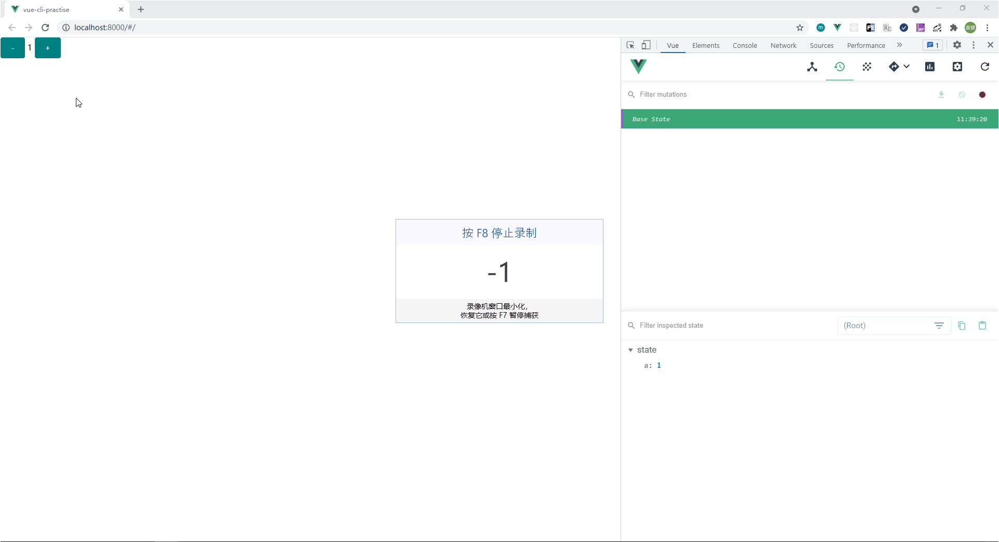

# 前端数据共享的那些事

## 发展历程

### 1，不辞辛苦的上下级组件间传递数据

```
<!-- parent.vue -->
<template>
    <div>
        <!-- 利用 js json 对象的引用方式去传递对象，然后所有子组件一起用 -->
        <child :data='\{ a: 1 \}'></child>
    </div>
</template>

<!-- child.vue -->
<template>
    <div>
        <!-- 子组件可以避开 vue.js 的警告对数据进行修改 -->
        \{\{ data.a \}\}
    </div>
</template>
```

评价：开发一时爽，接手火葬场！当共享对象被足够多的组件引用后，调试和定位问题将难以进行。比如：data.a 到底是被哪个组件修改的？又被改了多少次？

### 2，机智一点利用外部 js 文件共享数据

```
<!-- store.js -->
export default {
    a: 1
}

<!-- anyone.vue -->
<template>
    <div>
        <!-- common.a 等于 1 -->
        \{\{ common.a \}\}
    </div>
</template>

<script>
import data from './store.js'
export default {
    data() {
        return {
            common: data
        }
    }
}
</script>
```

评价：比 1 好一点，数据不再通过子组件传递。但问题依旧还在。

### 3，符合现代工程化的共享数据模式。即：flux 模型（本文将用 vuex 实现）

先简单介绍一下什么是 flux 模型？

**flux** 是一个“单向数据流”的思想模型，为的就是解决 1、2 两点的数据流程不清晰的问题。


这是最简单的实现方式，其中：

View：代表视图

Actions：代表操作数据的动作

State：代表状态。即：共享的数据

如图所示，这是一个单向流程的过程。不允许反悔往回走

> 详情链接：http://www.ruanyifeng.com/blog/2016/01/flux.html

优点：可监控、可调试（基于 vue-devtools 上）、可实现良好的项目架构（体现在使用 vuex 上）

对应的缺点：心智负担大（既要学习如何使用、还要考虑该如何配置、在项目工期赶的情况下显得回报率低，这就是为什么很多人不爱用 vuex 的原因）

## 技巧

### 1，modules （模块化）

原先的合并 common-store 的方式

```
// 粗暴式合并
import Vue from "vue";
import Vuex from "vuex";
import commonStore from "@/utils/common-store";

Vue.use(Vuex);

const store = {
  state: {},
  mutations: {}
};

for (let key in commonStore) {
  store[key] = {
    ...store[key],
    ...commonStore[key]
  };
}

export default new Vuex.Store(store);
```

现在可以通过添加 namespaced 属性并设置为 true ，就可以直接通过 this.$store.state.moduleName.xxx 引用数据

具体例子：

```
<!-- user.js -->
export default {
  // 重点
  namespaced: true,
  state: {
    userName: "JJ"
  }
};

<!-- index.js -->
import Vue from 'vue'
import Vuex from 'vuex'
import user from './user'

Vue.use(Vuex)

export default new Vuex.Store({
  state: {
    a: 1
  },
  mutations: {
  },
  actions: {
  },
  modules: {
    user
  }
})
```

总结：其实这种重复的配置可以用 vscode 自带的代码补全功能将 index.js 这种代码保存，在需要的时候直接一键导入即可。总之：don't repeat your self !

### 2，数据模型的设计

适当的分类、尽可能的少扁平化

如表单：（visibility 可视、loading 加载等等，可以提高代码的可读性）

```
<!-- 修改前 -->
{
    a: 1,
    b: 2,
    c: 3
}

<!-- 修改后 -->
{
    form: {
        a: 1,
        b: 2,
        c: 3
    }
}
```

这么做的好处是，你处理异步提交或批量数据更新就不需要逐个引用，直接引用对象即可（data也适用）

如：

```
axios.post('url', $store.state.form)

<!-- 而非这样（效果立竿见影） -->
axios.post('url', {
    a: $store.state.a,
    b: $store.state.b,
    c: $store.state.c
})
```

如无必要，别加新的 key 。尽量提早准备好（你的接手同事可没你清楚什么时候会多出一个 key 值哦！）

如：

```
<!-- 原先默认的数据 -->
{
    a: 1
}

<!-- 经过一些业务代码后而添加的新数据 -->
{
    a: 1,
    b: 2
}
```

### 3，重置模型

为什么要配一个初始化的方法？

例如：登录后的用户、购物车 等类似较为庞大的数据，一旦用户推出登录了，该怎么快速且高效的重置这些信息？

直接上答案：

```
<!-- 利用返回字面量对象的方式快速生成一个全新对象 -->
function defaultState() {
  return {
    userName: "",
    userId: "",
    dealerId:"",
    dealerName:"",
    accessToken: "",
    isShowSignInOrSignUpDialog: false,
    dealerId: "",
    role: ""
  };
}

const state = defaultState();

const mutations = {
  resetState(state) {
    Object.assign(state, defaultState());
  }
};

const actions = {};

export default {
  namespaced: true,
  state,
  mutations,
  actions
};
```

### 4，持久化数据

store 数据一旦遇到页面刷新就会被清空，这种情况下，建议用 **vuex-persistedstate** 解决。（可以选择保存到 local、sessionStorage、cookies 上）

原理：利用 vuex 的 subscribe 去监听一切的数据变化。并将数据保存在本地上

> subscribe api 说明：https://vuex.vuejs.org/zh/api/#subscribe

> 文档： https://github.com/robinvdvleuten/vuex-persistedstate

## 实践

### 1，vue-devTools 的 Time Traveling 查询数据修改情况

如图所示，这里可以看到state的修改情况，甚至可以回到某一个特定的状态上进行调试



当然，也可以修改 store 和 data 里的数据。

题外话：actions 和 mutations 的区别？

一句话总结：在 Vuex 中，mutation 都是同步事务，而 actions 是用于处理异步任务的并最后通过 mutations 去修改状态。其实 mutations 中使用异步方法也可以，但就是 vue-devTools 无法监听到其中的数据变化。

### 2，关于减少共享数据的引用长度（即：何时使用 mapXXX 方法）

常用的 store 属性 我个人建议是挂载到 vue 实例上，其次再用 mapState 做扩展 到 computed 上（讲真，这真的很麻烦，我也没这个耐心去做）

一句话：嫌烦要经常用 . 去引入数据就用 mapXXX ，否则直接引用吧。