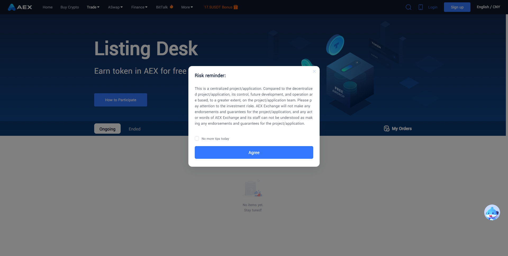
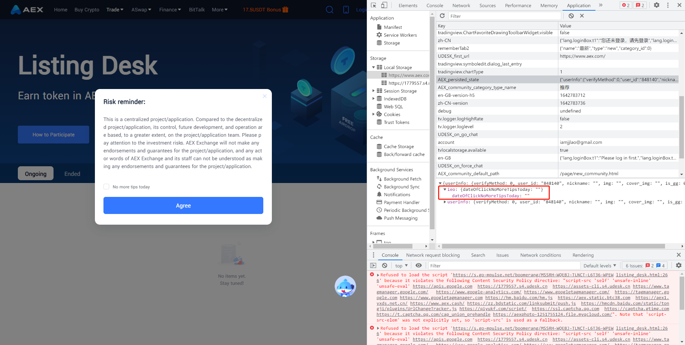

:::tip
资料整理: 刘嘉健   
更新日期: 2022-03-10
:::

# 背景

由于使用 Vuex 生成的状态对象都默认保存在内存上，一旦刷新了页面就都回归到初始状态（这是常见的情景）。

回到我们的项目中目前有应用到的场景有：

1. 目前我们原先获取 userInfo 的方式是通过 header 组件发起异步请求获取相应的数据。
   但是这里会有一个小问题，如果我的子组件在 userInfo 还没有返回时引用了 userInfo 内的属性时可能会引起一些异常。（比如：发起异步请求）

以前的解决方式是通过 watch 监听 userInfo 的变化再获取相应的数据去发起异步请求。（略笨重的一种处理方法）

其实只需要在登录后把 userInfo 持久化到本地，这样一来任何一个页面乃至子组件都可以不需要通过频繁的等待 userInfo 的方式去获取所需的数据。（减少不必要的重复请求）

2. Listing-Desk 项目首页有确认风险通知页面如图：



底下有个 “No more tips today” 即：今日不再提示。如果仅用 localStorage 实现在目前虽然没有什么问题，但从长远来说，维护零散的 **“状态”** 会变得困难。即使用了带前缀的 key 值，也只增加了辨识度而已，并未对可维护性方向有较大的改进。

解决办法是将对应的变量按 **“模块（module）”** 的方式进行组织，再持久化到本地。（更好的规划状态，相当于是告诉别人这个状态是归谁管）



3. 作为离线数据（列表类数据）

刚打开页面时趁异步数据还没返回前可以先展示旧的数据（类似骨架图），提升视觉体验。

目前状态持久化的应用场景大概是在以上几点。

讲了这么多，为的还是引入 vuex-persistedstate 的使用。

# 介绍

官方的介绍是：在页面刷新之间就做好持久化和反序列化的工作。

详细一点就是：你可以持久化 vuex 状态到 local、sessionStorage、cookies 上，在页面刷新之间会自动的把初始状态修改回刷新前的状态。

# 常规使用

<!-- 该文件作为 vuex 的插件使用 -->

plugins/PersistedState.js

```
import createPersistedState from 'vuex-persistedstate';

export default createPersistedState({
    // 保存到 localStorage 的 key 值。已经确定的值，不要改就好了
	key: 'AEX_persisted_state',
    // 仅将特定的 state 值持久化到本地。例如：'a' => 'state.a' 对应的值持久化到本地。
    // 目前暂时不需要使用。
	paths: [
        // 像 isLogin、language 这些值初始化就已经计算好了，就不需要做持久化。
        // 'isLogin',
        // 'language',
        'userInfo',
        'ieo'
    ]
});
```

store/index.js

```
import PersistedStatePlugin from '@/store/plugin/PersistedState';
Vue.use(Vuex);

const store = {
	state: {
	},
	mutations: {
	},
	actions: {
	},
	modules: {
	},
	plugins: [PersistedStatePlugin]
};

```

# 用前须知（避坑 与 一些思考）
1. 所有的状态都有必要去做持久化吗？

注意一下示例中的代码注释。如：isLogin、language 这些值初始化就已经计算好了，就不需要做持久化。因为在 vuex 初始化代码的执行顺序下，计算后的新值会被持久化的值所覆盖。

2. Vuex 初始化代码执行优先级需要提到最高级

如以下代码：vuex 的加载优先级是仅次于 Vue 的

```
import Vue from 'vue';
import store from './store';
...
```

3. 在多个 tab 栏里如何做到状态共享？（可根据需要去使用）

具体实现方式如该 [github issues](https://github.com/robinvdvleuten/vuex-persistedstate/issues/232#issuecomment-926118491)

实现原理是监听 storage 事件

```
// Reload state from disk when it changes in any other tab.
// @see https://developer.mozilla.org/en-US/docs/Web/API/Window/storage_event
window.addEventListener('storage', event => {
  if (event.key === 'AEX_persisted_state') {
    store.replaceState(JSON.parse(localStorage.get('AEX_persisted_state')))
  }
})
```
